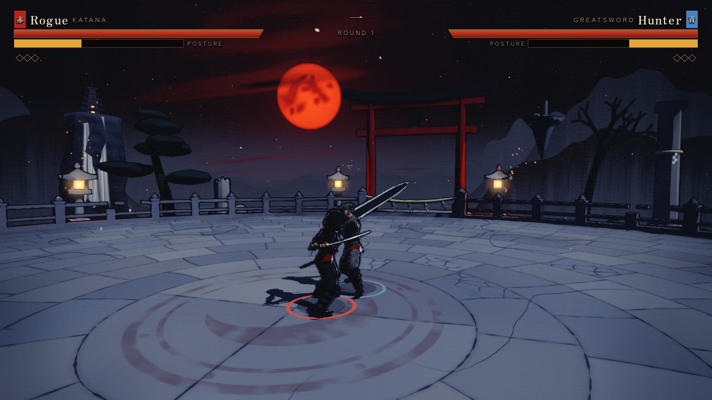
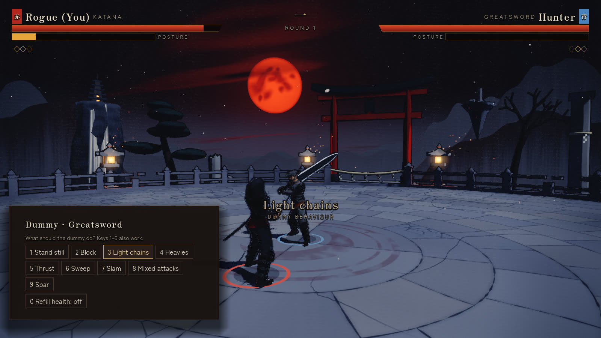
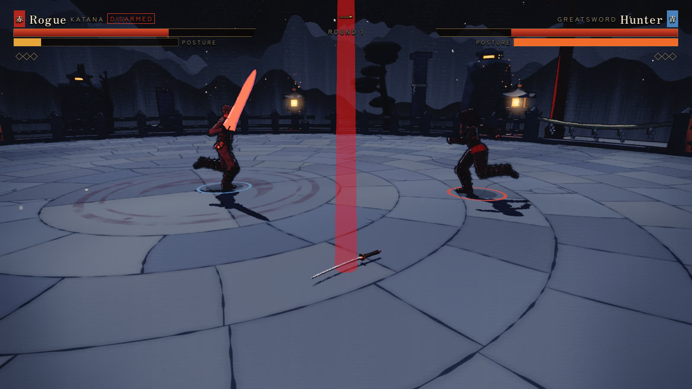

# Monomachia

**A one-on-one weapon duel for Windows.** Read your opponent, parry on the
clang, break their posture and send their weapon flying.



Monomachia (Greek for "single combat") is a third-person 1v1 arena fighter,
built in [Godot](https://godotengine.org) 4.7. This build has two fighters,
the Rogue and the Hunter, who can each wield the Katana, the Greatsword or the
Twin Daggers, on the Moonlit Shrine, a walled arena floating under a red moon.
It began as a three.js browser demo, kept at the tag
[`v0.1-web-mvp`](../../tree/v0.1-web-mvp).

The game is changing direction: animation will set the rules' timing at a
slower, weightier pace, and a realistic look after Ghost of Tsushima's darker
side will replace this toon one. Milestone 1 brings the Hunter with the Katana
and bare hands to final quality; milestone 2 does the same for the other
weapons. See [docs/design.md](docs/design.md),
[ADR 0001](docs/adr/0001-animation-leads-realistic-look.md) and
[the roadmap](docs/plans/roadmap.md). The screenshots here show the current
build and will be replaced when the new look lands.

## Play

Download `Monomachia-<version>-windows.zip` from the
[Releases](../../releases) page, unzip it and run `Monomachia.exe`. The first
release follows the merge of the Godot rebuild into `master`; until then,
build it yourself (see [Build and develop](#build-and-develop)).

| Mode | What it is |
| --- | --- |
| Duel | You against the computer, at three skill levels. First to 3 rounds. |
| Training | A dummy you tell what to do (keys 1–9, or the pause menu on a controller), with health refill (key 0). |
| Watch | Two computer fighters duel while you watch. |

Versus, two players on one PC in a split screen, comes in a later update.



## How a fight works

- **Winning.** Empty the other fighter's health to win a round; first to 3
  rounds wins. The camera stays locked on: forward moves toward the opponent,
  left and right circle around them.
- **Strings.** Light and heavy attacks run into strings, which the move list
  (in the pause menu and How to play) shows for each weapon. They aren't
  guaranteed: from the second hit on, the defender can block or parry. Hold
  heavy to charge it. Hits land where the weapon really sweeps through the
  opponent's body.
- **Block and parry.** Hold block to stop health damage; you can walk while
  blocking. Tap block just before a hit to parry: their weapon bounces off,
  their posture fills and you strike first.
- **Dodge and jump.** A dodge with a direction dashes through normal attacks;
  with no direction it is a backstep.
- **Posture.** The bar under your health. Hits, blocks, parries and counters
  you take fill it, and it drains only while you hold block and aren't being
  hit. While it is full, being parried or blocking an unblockable, a fully
  charged heavy or an ultimate **disarms you**.
- **Unblockables** (red 危 mark) each have a counter: dodge **toward** a thrust
  to stomp the blade, **jump** a sweep to vault off the attacker, **back-dash**
  a slam and press light for a counter lunge. All three can also be parried.
- **Disarmed.** Your weapon flies away and you fight with bare hands: faster,
  with longer dodges and higher jumps, but no block. A timed block press
  becomes a redirect counter. Stand on your weapon and press pick up to re-arm.
- **Ultimate.** At 25% health or less, press light + heavy together (or the
  ultimate button), once per round. Armed, it is your weapon's signature
  technique; disarmed, you choose Recall (your weapon returns to your hand
  with a burst that knocks a close opponent down) or Breaker Palm (a big
  posture blow).



| Weapon | Style | Ultimate |
| --- | --- | --- |
| Katana | Balanced and quick, with the Iai Slash from the sheath | Moonsplitter: a slash wave, vertical (sidestep it) or horizontal (jump it) |
| Greatsword | Slow, with huge reach and posture damage | Impaler: a lunging skewer, then a burst |
| Twin Daggers | Very fast, with short reach | Lightning Tempest: a flash strike into a spinning flurry |

## Controls

Every action can be remapped (main menu → Controls) for keyboard, mouse and
controller, and saved in named profiles. PlayStation and Xbox controllers
show their own button names, and there is an 8-button fight-stick preset.

| Action | Keyboard & mouse | PlayStation | Xbox |
| --- | --- | --- | --- |
| Move around the opponent | W A S D or the arrow keys | Left stick / D-pad | Left stick / D-pad |
| Light attack | Left click or J | R1 | RB |
| Heavy attack (hold to charge) | Right click or K | R2 | RT |
| Block / parry | Left Shift or L | L1 | LB |
| Dodge / backstep | Space | ○ | B |
| Jump | F or I | ✕ | A |
| Ultimate | Q or U, or light + heavy | △, or R1 + R2 | Y, or RB + RT |
| Block ability 1 / 2 | Hold block + light / heavy | Hold L1 + R1 / R2 | Hold LB + RB / RT |
| Pick up weapon | E | □ | X |
| Sprint | Double-tap a direction and hold | L3, or double-tap | L3, or double-tap |
| Pause | Esc or P | Options | Menu |

Tap a direction to step.

## Build and develop

You need [Godot 4.7.2](https://godotengine.org/download) (the standard build,
with its export templates to build the exe) and [Node.js](https://nodejs.org)
22.12 or newer. npm is only the task runner: there is nothing to install, and
every command goes through `scripts/godot.mjs`, which finds Godot through the
`GODOT` environment variable, `godot` or `godot4` on your PATH, or a
`.godot-path` file at the repository root holding the path to Godot's
executable (on Windows, the `*_console.exe` one).

```sh
npm test             # the Node tools' tests, then the game's GUT tests headless
npm run typecheck    # loads every GDScript file; fails on parse or type errors
npm run play         # plays the game
npm run dev          # opens the Godot editor
npm run soak -- 40   # 40 computer-vs-computer matches; prints balance numbers
npm run build        # exports build/windows/Monomachia.exe
```

`npm run shots -- res://tools/shot_scenes/<scene>.tscn shots/<name>.png`
renders a scene to a PNG; `npm run counterlab` measures how often the computer
lands each unblockable's counter; `npm run bench` times every frame of the
worst-case replay at 4K against the 60 fps gate; `npm run studio` opens the Animation Studio,
a gallery and editor for the clips; `npm run godot -- help` lists the
runner's other commands.

**The animation clips.** The fighters' combat animation comes from licensed
Kevin Iglesias packs, which can't be published. They live in a private asset
repository: with access to it, put the path of its clone in a
`.assets-src-path` file at the repository root and run
`npm run godot -- clips` to build the clip libraries. A plain clone plays with
labelled stand-in clips instead (free CC0 ones, on which the weapons float off
the hands), and the tests that need the clips skip. Builds made without them
carry a `STAND-IN.txt`.

For a map of the whole codebase with diagrams, see
[docs/architecture.md](docs/architecture.md). Contributors' working rules are
in [CLAUDE.md](CLAUDE.md).

| Folder | What it holds |
| --- | --- |
| `game/sim` | The rules, with no graphics. They run at a fixed 60 steps per second and are deterministic, so a match plays out the same on every computer. `fighter.gd` (states), `world.gd` (hits, blocks, parries, counters), `match.gd` (rounds), `ai/` (the computer opponent and training dummy). |
| `game/sim/moves` | Each weapon's frame data (`<weapon>.gd`) and its moves' baked hit paths (`swings/<weapon>.json`). Global tuning is in `game/sim/constants.gd`. |
| `game/view` | What you see: the fighters and their animation, weapons, camera, effects and the match view. |
| `game/fighters`, `game/weapons`, `game/arenas` | Each fighter's, weapon's and arena's models and scenes. |
| `game/ui`, `game/input`, `game/audio` | Menus and HUD; keyboard, mouse and controller bindings and profiles; sound and music. |
| `game/assets` | Fonts, textures, sounds and the clips' manifests. `game/assets/CREDITS.md` and `game/assets/audio/SOURCES.md` record where each came from. |
| `game/tests` | The GUT tests: the rules, the view, input, audio, content and tools. |
| `game/tools` | Headless tools (the soak, counterlab, typecheck, clip import and swing bake), the Animation Studio and the screenshot scenes. |
| `scripts` | The task runner (`godot.mjs`), the release command, the size check and the audio pipeline (`npm run audio:sonniss`, `audio:synth`, `audio:music`). |
| `tests` | Tests of the Node tools, on Node's own runner. |
| `brain` | The second brain: an Obsidian vault of the project's knowledge. `npm run brain` generates its notes on every glossary term, plan task, doc section and `game/` folder into `brain/generated/`, which isn't committed, and `npm run brain:serve` opens it at http://localhost:5196. |
| `tools/second-brain` | Builds the vault and serves its viewer. See `docs/specs/second-brain.md`. |
| `tools/lanes-board` | The Project Manager (`npm run board`, http://localhost:5197): a live page of every plan's progress and every worktree's session, where tasks are queued and launched into their own Claude sessions. See `CLAUDE.md`. |
| `docs` | The design document, specs, plans, ADRs, research and reviews. |

## Publishing on GitHub

- **CI** (`.github/workflows/ci.yml`) runs on every push and pull request: the
  size check, the tests, the typecheck and a 4-match soak, then a Windows
  export. That export has no licensed clips, so it is a stand-in build,
  offered on the run's page as `Monomachia-windows-stand-in` and never
  released.
- **Releases** are made on the developer's PC, with the clips:
  `npm run release -- v<version>` (the version in `game/project.godot`, with
  an optional `-suffix`) exports the game, checks it with the exe's `--smoke`
  run (a computer-vs-computer match played to the results), zips it as
  `Monomachia-<tag>-windows.zip` with the licence, credits and notices, and
  attaches it to a draft GitHub release for that tag. Publishing the release
  is a click on GitHub.

## Credits

Made by Andrew Rodriguez. The source is visible here, but all rights are
reserved: you may view and fork it on GitHub, and download and play the builds
published on the Releases page, but not redistribute or sell them. See
[LICENSE](LICENSE).

The fighters and stand-in animations come from Quaternius (CC0), the combat
animations from Kevin Iglesias' packs (in release builds only), the sound
effects partly from the Sonniss #GameAudioGDC bundle, and the fonts are under
the SIL Open Font License. [CREDITS.md](CREDITS.md) lists every source and
licence, and each build carries it as `CREDITS.txt`, with Godot's licence
notices in `THIRD-PARTY-NOTICES.txt`.
