# Monomachia: a map of the code

Oct 2, 2026 · written at commit `9205183` on `feature/godot-rebuild`

> **Superseded by [ADR 0001](adr/0001-animation-leads-realistic-look.md) (Oct 4, 2026):** This page still maps the code as it stood on Oct 2. Under ADR 0001, an attack's frame data and footwork come from its clip, a realistic look replaces the toon and ink-wash look, and the RTX 3090 is the target; the sections marked with it are replaced as the slice lands.

This is a guide for a developer who is new to the repository. It shows what each folder holds, how the pieces connect, and how one frame of a duel flows from a button press to a sound. The diagrams are Mermaid and render on GitHub.

It describes the code, not the game. For the game's rules and vision read `docs/design.md`, for the web demo's spec `docs/mvp-spec.md`, for the Godot rebuild `docs/specs/godot-rebuild.md` and `docs/plans/godot-rebuild.md`, and for the vocabulary `GLOSSARY.md`. Where this page names a concept (Fighter, Weapon, Posture, Parry, Counter and so on) it uses the glossary's meaning.

Line numbers drift, so this page names files and functions rather than lines. Search for the function name.

## Contents

1. [Where the game came from](#1-where-the-game-came-from)
2. [The repository at a glance](#2-the-repository-at-a-glance)
3. [The Godot game: layers and rules of thumb](#3-the-godot-game-layers-and-rules-of-thumb)
4. [Boot and the scene tree](#4-boot-and-the-scene-tree)
5. [One frame, end to end](#5-one-frame-end-to-end)
6. [The rules (`game/sim`)](#6-the-rules-gamesim)
7. [Input (`game/input`)](#7-input-gameinput)
8. [Shared services (`game/core`)](#8-shared-services-gamecore)
9. [Drawing the match (`game/view`)](#9-drawing-the-match-gameview)
10. [Fighters, weapons and arenas (content)](#10-fighters-weapons-and-arenas-content)
11. [The look: shaders and graphics presets](#11-the-look-shaders-and-graphics-presets)
12. [Sound and music (`game/audio`)](#12-sound-and-music-gameaudio)
13. [Screens and the HUD (`game/ui`, `game/scenes`)](#13-screens-and-the-hud-gameui-gamescenes)
14. [The web demo (tag `v0.1-web-mvp`)](#14-the-web-demo-tag-v01-web-mvp)
15. [Tests](#15-tests)
16. [Tools, scripts and pipelines](#16-tools-scripts-and-pipelines)
17. [CI and releases](#17-ci-and-releases)
18. [Docs and where work is tracked](#18-docs-and-where-work-is-tracked)
19. [Recipes: where to make common changes](#19-recipes-where-to-make-common-changes)
20. [Traps](#20-traps)

---

## 1. Where the game came from

Monomachia began as a web demo: TypeScript, three.js and Vite, built into one self-contained HTML file, with block puppets posed by code and sound synthesised at runtime. The Godot game in `game/` was ported from it, and plan task 26.2 deleted the demo's code. Tag `v0.1-web-mvp` keeps it, and comments in the Godot code cite its files as `v0.1-web-mvp:src/…`, a path `git show` takes as written. Section 14 maps its files to the Godot code.

The Godot rules in `game/sim` started as a line-for-line port of the demo's `src/sim`, checked bit for bit against the TypeScript up to commit `4222167`. Since then the rules have changed on purpose (fluid combat, new strings), so the two no longer match. The parity fixtures the port was checked against stay in `game/tests/fixtures` as frozen data (its README says where their generators went).

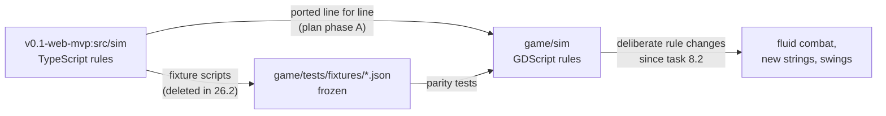

## 2. The repository at a glance

```mermaid
flowchart TD
    ROOT["monomachia/"]
    ROOT --> GAME["game/<br/>Godot 4.7 project"]
    ROOT --> TESTS["tests/<br/>node --test: audio pipeline, size guard,<br/>credits, release, lanes board, second brain"]
    ROOT --> SCRIPTS["scripts/<br/>Node tooling: Godot runner, release, size guard, audio generation"]
    ROOT --> TOOLS["tools/<br/>lanes board, second brain"]
    ROOT --> DOCS["docs/<br/>design, specs, plans, research"]
    ROOT --> GH[".github/workflows/<br/>CI"]
    ROOT --> META["CLAUDE.md, README.md, GLOSSARY.md,<br/>LICENSE, CREDITS.md, package.json"]

    GAME --> G_SIM["sim/ rules, no graphics"]
    GAME --> G_INPUT["input/ devices, bindings, profiles"]
    GAME --> G_CORE["core/ GameServices autoload, settings, match config, roster"]
    GAME --> G_VIEW["view/ match host, camera, fighter animation, look"]
    GAME --> G_AUDIO["audio/ sound bank, players, music"]
    GAME --> G_UI["ui/ HUD and menus"]
    GAME --> G_SCENES["scenes/ main.tscn, main.gd, smoke run"]
    GAME --> G_CONTENT["fighters/ weapons/ arenas/ shaders/"]
    GAME --> G_ASSETS["assets/ Quaternius models, audio, weapon sources"]
    GAME --> G_TOOLS["tools/ headless scripts, screenshot scenes"]
    GAME --> G_TESTS["tests/ GUT tests"]
    GAME --> G_ADDONS["addons/gut/ test framework (vendored)"]
```

| Folder | What it holds |
| --- | --- |
| `game/sim` | The rules: fighters, world, match, moves, AI. Pure `RefCounted` objects, stepped 60 times per second, no nodes or rendering. |
| `game/sim/moves` | Frame data for each weapon (`katana.gd`, `greatsword.gd`, `daggers.gd`, `fists.gd`), the `AttackDef` and `WeaponDef` records and the `Moves` registry; the baked swings (`swings/<weapon>.json`) and the frame-data table (`frame_data.json`, read by `FrameDataTable`), both written by `godot.mjs bake`; the band tables (`bands.json`, read by `MoveBands`), written by hand from the spec. |
| `game/sim/ai` | `AIBrain` (the computer opponent) and `TrainingBrain` (the training dummy). |
| `game/input` | Reading keyboards, mice and controllers into a `RawInput` per player; bindings, profiles, rebinding, button labels. |
| `game/core` | `GameServices` (the only autoload), `GameSettings`, `MatchConfig`, `MatchSide`, `MatchResults`, `Roster`. |
| `game/view/match` | `MatchHost` (the fixed-step loop), `MatchView`, `CameraRig`, `MatchAudio`, `StickPose`, the arena registry. |
| `game/view/fighter` | Animating a rigged fighter from the rules' state: the clip director, locomotion, foot locking, IK rig. |
| `game/view/look` | The realistic look (milestone-1 task 43): physically based materials (`LookMaterials`), the night and its colour grade (`LookGrade`), the film grain (`FilmGrain`), the shared noise, the palette and render layers, and the four graphics presets with Ultra as the reference (task 29). The toon materials, outlines and ink-wash pass are gone. |
| `game/view/mesh_kit*.gd` | Procedural mesh building for props and stand-ins. |
| `game/fighters`, `game/weapons`, `game/arenas` | Content: fighter models and palettes, weapon models, the Moonlit Shrine. |
| `game/shaders` | Every `.gdshader` and shared include. |
| `game/audio` | `SoundBank` (event to sound table), `SoundPlayer`, music director and player, footsteps. |
| `game/ui` | The HUD (`MatchHud` and its pieces) and the menu screens on a `ScreenStack` (`TitleScreen`, `MainMenu`, `FighterSelect`, `PauseScreen`, `ResultsScreen`, `SettingsScreen`, `ControlsScreen`, `HowToPlayScreen`). |
| `game/scenes` | `main.tscn` and `main.gd` (the screen flow) and `smoke_run.gd` (the `--smoke` check). |
| `game/tools` | Headless scripts: soak, typecheck, screenshots, asset builders and bakers. |
| `game/tests` | GUT tests, by area. |
| `tests/` | The Node tests of the tools and scripts (section 15). |
| `scripts/` | Node scripts behind the `npm run` commands (section 16). |

## 3. The Godot game: layers and rules of thumb

Three rules hold the code together:

1. **The rules never depend on the presentation.** Nothing in `game/sim` or `game/input` refers to a view, audio, UI or content class. The view, HUD and audio read the rules' state and listen to its events, but never change it.
2. **The rules never see the wall clock.** Every duration in `game/sim` is in frames at 60 per second. `MatchHost` turns real time into steps.
3. **The rules are deterministic.** Same seed, same inputs, same match. Randomness comes only from `Rng` (seeded per match and per AI), and the order of updates is fixed.

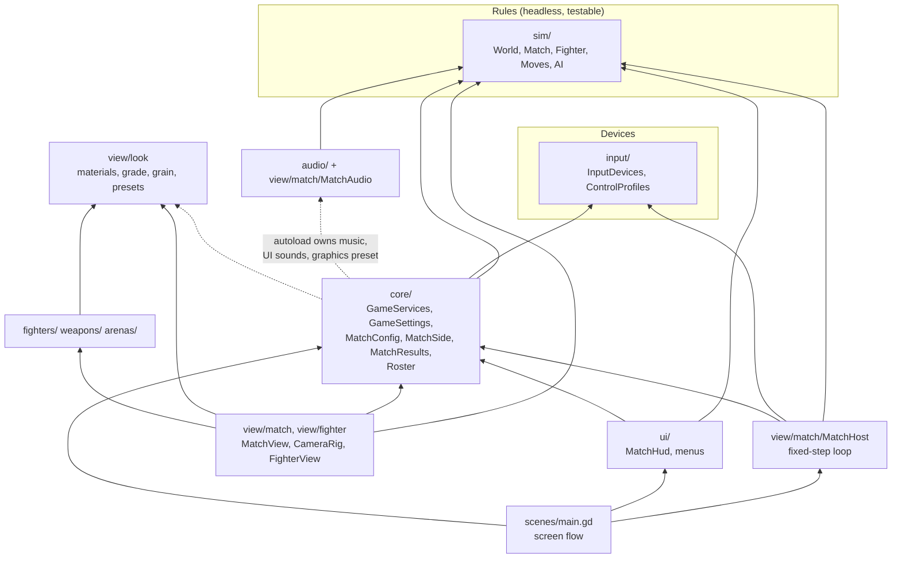

The dotted arrows are the one place the layering bends: the `GameServices` autoload creates the music player and UI sound player, and applies the graphics preset, so `core` refers to `audio` and `view/look`. Nothing in `sim` or `input` does.

The rules talk to everything else through exactly three channels, all on `MatchHost`:

- the `sim_event(e: Dictionary)` signal, once per rules event, in the order the world emitted them;
- the `stepped(step)` signal, after each rules step;
- read-only access to `host.fighter(i)`, `host.world` and `host.sim_match`.

## 4. Boot and the scene tree

`project.godot` sets `res://scenes/main.tscn` as the main scene and registers one autoload, `GameServices`. It defines no gameplay input actions: all gameplay input goes through `game/input`. Menus use Godot's built-in `ui_*` actions. The 60 Hz rate does not come from Godot's physics tick; `MatchHost` keeps its own accumulator.

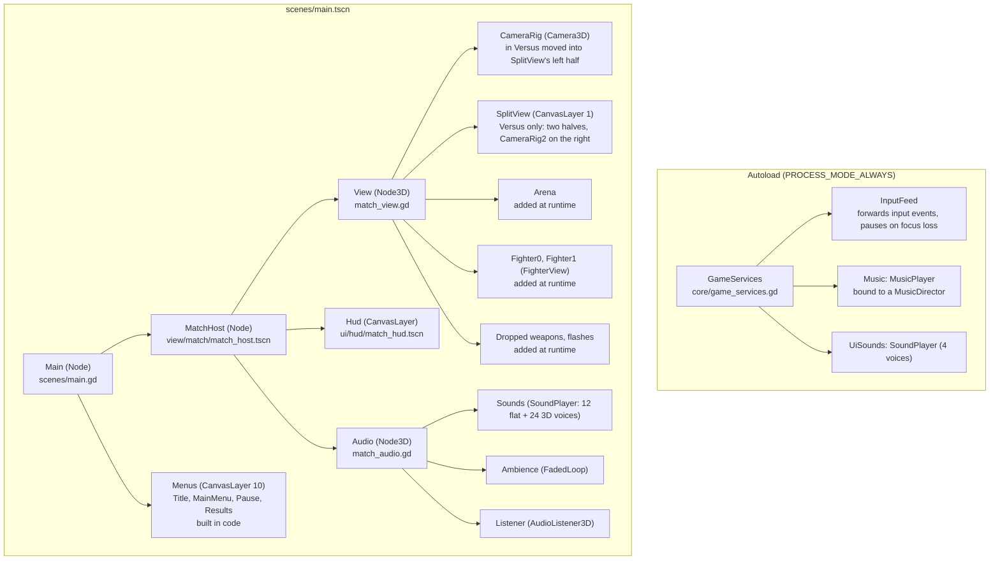

At startup `main.gd` builds the menu screens, connects to the host's signals, starts the **attract duel** (a computer-versus-computer match playing silently behind the title and menus) and shows the title. With `--smoke` on the command line it instead plays a Watch match to the results and quits with the outcome; CI uses this to check the exported game.

Signal handlers run in the order they were connected. Children run `_ready` before their parent, so every `sim_event` reaches the View first, then the HUD, then the Audio, then `main.gd`.

## 5. One frame, end to end

`MatchHost` (`view/match/match_host.gd`) is the heart of the game. Each rendered frame it adds the frame's time (capped at 0.1 s and scaled by the rules' slow motion, `world.time_scale()`) to an accumulator and takes one rules step per 1/60 s in it, at most six per frame; past that it drops the backlog. Tests and the smoke run skip the clock and call `step(n)`.

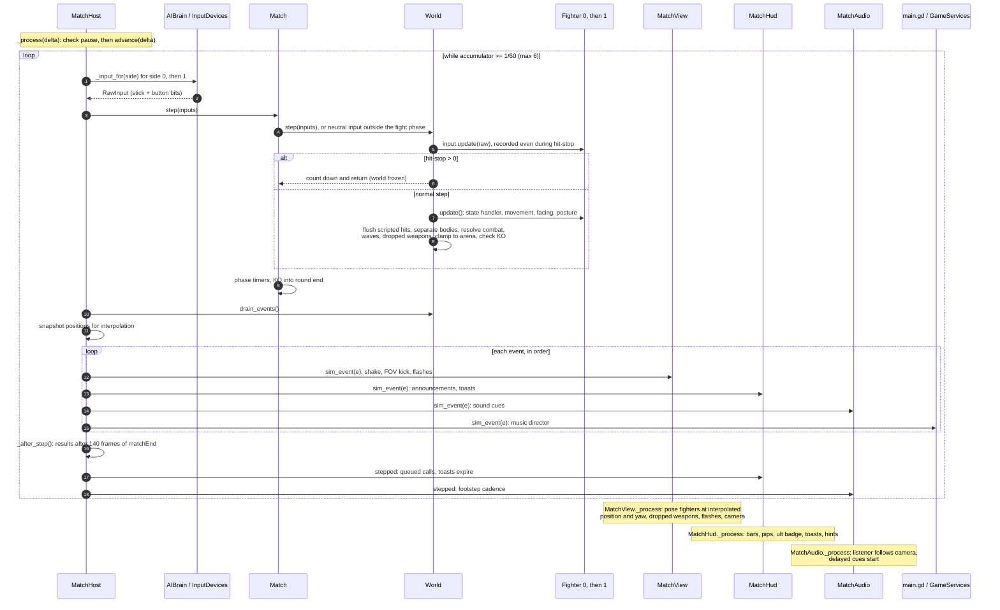

**Interpolation.** The host keeps each fighter's position and yaw from before and after the last step. `display_position(i)` and `display_yaw(i)` blend them by `alpha()`, the fraction of a step left in the accumulator. During hit-stop `alpha()` holds at 1 so poses don't jitter, and a `roundStart` event places fighters instead of blending them.

**Pause.** The pause binding, Esc, Start or the window losing focus calls `host.pause()`; `pause_changed` opens the pause menu (`PauseScreen`) and holds the match's sounds. The same press resumes, unless a screen is open over the pause menu (Move list, Controls, Settings): `main.gd` then turns `host.pause_press_resumes` off, so Esc is only that screen's Back. A rules button pressed in a menu is ignored by the match until it is let go, so pressing A to resume doesn't also jump, and a profile picked in the pause's Controls is taken up on resume.

## 6. The rules (`game/sim`)

Every file in `game/sim` says in its header which of the demo's files (`v0.1-web-mvp:src/sim/*.ts`) it was ported from.

### 6.1 Files

| File | Class | What it is |
| --- | --- | --- |
| `match.gd` | `Match` | Rounds and the match: phases, wins, the round call. Owns the `World`. |
| `world.gd` | `World` | Both fighters, dropped weapons and Moonsplitter waves; resolves every hit. Emits events. |
| `fighter.gd` | `Fighter` | One fighter's state machine: movement, guard, attacks, dodges, counters, disarm, ultimates. The biggest file. |
| `attack_state.gd` | `AttackState` | The attack in progress: its `AttackDef`, frame, charge, queued follow-up, lunge. |
| `dodge_state.gd` | `DodgeState` | The dodge or backstep in progress: direction, distance, invulnerable frames. |
| `ult_state.gd` | `UltState` | The ultimate in progress: kind, phase, frames in phase. |
| `fighter_config.gd` | `FighterConfig` | What a fighter is built from: weapon, abilities, name. |
| `fighter_stats.gd` | `FighterStats` | Per-match counters for the results screen. |
| `dropped_weapon.gd` | `DroppedWeapon` | A weapon knocked out of a fighter's hands. Since milestone-1 task 86 it draws nothing from the world's generator: `heading()` follows the blade's motion at contact (the blow's for a knock, the attacker's reversed for a deflect, else straight away), `landing()` shortens the 3.5 m flight to land inside the walls, and it flies a fixed arc to stick blade-first 25° from vertical (`pitch`, rules state), with a `weaponStuck` event. |
| `slash_wave.gd` | `SlashWave` | A Moonsplitter wave travelling across the arena. |
| `events.gd` | `SimEvents` | The list of event types and their payloads (documented in its header). |
| `input_tracker.gd` | `InputTracker` | Turns each frame's `RawInput` into presses, releases, an 8-frame buffer, steps and sprint. |
| `raw_input.gd` | `RawInput` | One frame of input: stick `mx`, `my` and a button bitmask. |
| `btn.gd` | `Btn` | Button indices: LIGHT, HEAVY, BLOCK, DODGE, JUMP, INTERACT, ULTIMATE, SPRINT. |
| `constants.gd` | `SimConst` | Global tuning. |
| `protected_timings.gd` | `ProtectedTimings` | The protected timings (milestone-1 task 22), frozen: hitstun, blockstun and hit-stop by move kind, the charge bonus, the outcome hit-stops, the counters' stuns, the disarm's stagger and daze, and the knockdown's phases; the Katana's and bare hands' retuned set and today's, which the Greatsword and the Daggers keep. `for_weapon()` gives the set a move's weapon decides (the outcomes, at once); `for_move()` the set its own values come from (retuned once its family re-keys it). Pinned by `test_protected_timings.gd`. |
| `sim_math.gd` | `SimMath` | Angles, easing, `js_round`. |
| `js_math.gd` | `JsMath` | V8-exact `sin`, `cos`, `atan2`, `hypot` (see [Traps](#20-traps)). |
| `rng.gd` | `Rng` | Mulberry32, bit-exact with the TypeScript. |
| `sim_state.gd` | `SimState` | Snapshots and the state hash (milestone 1): `capture()` copies an object's script variables but those it names in `SNAPSHOT_SKIP` (links, output), sharing only content (`WeaponDef`, `AttackDef`, `FighterBody`, `AIParams`); `state_hash()` is SHA-256 over a canonical form. `World`, `Fighter`, `Match`, `DroppedWeapon`, `SlashWave`, `Rng`, the brains and `TrainingUpkeep` each have `snapshot()`, and `World`, `Fighter`, `Match`, `DroppedWeapon`, `SlashWave` and `Rng` a `restore()` that puts one back (a rollback); `World.state_hash()` and `MatchHost.state_hash()` (the match seam: world, match, brains, upkeep) hash them. |
| `v2.gd`, `v3.gd` | `V2`, `V3` | 64-bit vectors (Godot's `Vector3` is 32-bit). |
| `moves/attack_def.gd` | `AttackDef` | One move's frame data and flags; `finalize_moves()` fills defaults. |
| `moves/frame_data_table.gd` | `FrameDataTable` | The committed frame-data table (milestone-1 task 16): each move's band kind, chain, generated frame data and per-frame travel, each gait clip's measured speed, each rules-length clip's length (and for the recall burst's blasted fall its travel, `clip_travel_at()`, which the rules carry the blasted fighter by, milestone-1 task 99), the clips not keyed yet, and per row the source clips' checksum and a digest of the row with its swing (`digest()`), which CI recomputes. |
| `moves/move_bands.gd` | `MoveBands` | The band tables (milestone-1 task 18): the spec's timing bands and distance bands per weapon and move kind, and the moves waiting for their family's re-key; `timing_problems()` holds a table row to its timing band, `distance_check()` plays a move from standing (`SwingReach`) at each distance its band names. Read by `test_move_bands.gd` and the Studio, never by the rules. |
| `moves/follow_up_check.gd` | `FollowUpCheck` | The free-frame rule over the follow-up pairs (milestone-1 task 22): how many frames a defender hit on a move's last active frame is free before its follow-up lands from its branch point, and each branch point against the earliest its kind allows, over the pairs off the band tests' waiting list. Read by tests, never by the rules. |
| `moves/weapon_def.gd` | `WeaponDef` | One weapon: class, speed, parry window, block mitigation, its moves and which move starts each context. |
| `moves/moves.gd` | `Moves` | The registry: `WEAPONS`, `PLAYABLE_WEAPONS`, `COUNTER_LUNGE`, `ULT_HITS`, `get_move()`. |
| `moves/katana.gd`, `greatsword.gd`, `daggers.gd`, `fists.gd` | `KatanaMoves` and so on | Each weapon's `MOVES` table and `build()`: what design sets (damage, posture, kind, type, follow-ups, lunges and the like). Since milestone-1 task 17 the frames (startup, active, recovery, the dodge cancel, the travel) come from the frame-data table (`AttackDef.finalize_moves()` given the weapon, `TABLE_FIELDS`). Fists is the bare-hands moveset. |
| `ai/ai_brain.gd` | `AIBrain` | The computer opponent. Since milestone-1 task 107 it presses a finisher prompt on its difficulty's share (`AIParams.finisher`, from its own generator, at a frame of the window between `finisher_from` and `finisher_to`) and otherwise plays on with no heavy press that would take it. Since task 40 a string's follow-up is pressed `COMBO_LEAD` frames before the move's branch point into it, so the re-keyed lights chain, and a string runs up to four hits. Since KE task 9 it plays the grips: `wanted_grip()` picks one by the situation at Normal and Hard (posture first, then an opponent guarding a lot or inside two-handed reach, then range), Hard also switches mid-string, and a string's heavy ending, pressed for through `Fighter.follow_up()`, is sometimes charged (`AIParams.grip_switch`, `grip_mix`, `branch_charge`). |
| `ai/training_brain.gd` | `TrainingBrain` | The training dummy's drills. Its heavies run both Iai draws in a four-turn cycle (milestone-1 task 83). |
| `training_upkeep.gd` | `TrainingUpkeep` | Training's upkeep, stepped by the host after each rules step: getting up after a K.O., the refill (90 frames unhurt, then 2 HP a frame, the dummy's posture draining as fast), the dummy re-arming after 240 frames disarmed; since milestone-1 task 107 a finisher's victim stays down until the finisher ends, then comes back at full HP and posture, re-armed, its weapon gone from the floor. `weapon_for()` and `swap_dummy_weapon()` give the dummy a weapon that can perform a behaviour. |
| `finisher_rules.gd` | `FinisherRules` | The finisher's rules (milestone-1 task 103): a disarm at 5% HP or less opens the prompt (`World.prompt_*`, 18 rules frames at 0.3×); only a fresh heavy press inside it starts the paired finisher (`World.finisher_*`, the states `finisher` and `finished`), other presses forfeit it; the line-up, the kill and the K.O. Until tasks 104 and 105 one stand-in (`SimConst.FINISHER_*`) serves both; `ClipDirector.finisher_clip()` borrows the Iai Slash or the Cross to show it. |
| `unblockable_routes.gd` | `UnblockableRoutes` | The routes table (milestone-1 task 83): how each weapon performs each unblockable, by counter kind. The dummy drills from it; `can_perform()` tells Training's swap, the roster's drill list and the host which weapons can drill what. |

### 6.2 Data model

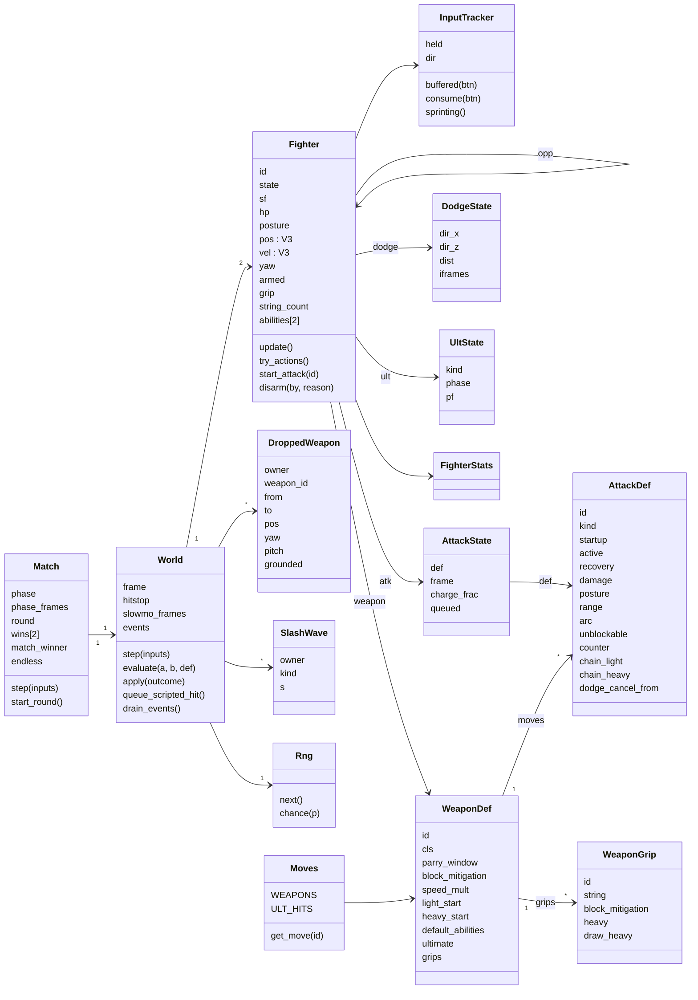

### 6.3 A rules step

`World.step(inputs)` runs this order every frame. The order is part of the rules: changing it changes outcomes.

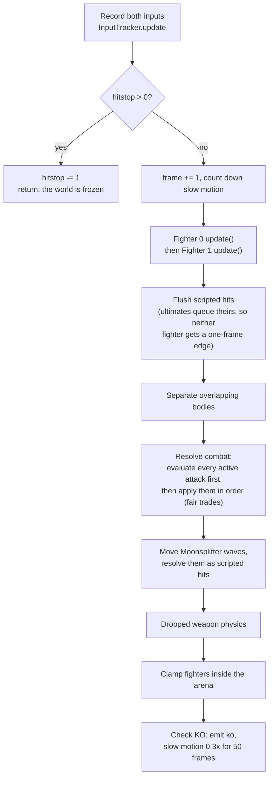

Inside `Fighter.update()`: count the frame in the state (`sf`), handle a block press (open the parry window, shrinking it for mashing), run the current state's handler (which may call `try_actions()`), integrate movement, turn to face, regenerate posture, and announce `ultReady` once.

`try_actions()` picks the player's action in this priority: ultimate (button or light + heavy within 4 frames), block ability (block + light or heavy), pick up weapon, dodge (backstep with no direction), jump, light or heavy (chosen by context: counter-lunge window, in the air, sprinting, after a dodge or backstep, or the normal starter), then a step on a fresh stick push.

### 6.4 What a swing does when it connects

`World.evaluate(attacker, target, def)` decides one outcome; the first matching check wins. `World.apply()` then applies it.


| Outcome | Effect |
| --- | --- |
| hit | Damage (×1.8 at full charge, ×1.6 for a backstab), posture ×1.5, hitstun and knockback, or KO. |
| block | Posture by the weapon's block mitigation (or the move's guard crush), blockstun, knockback. |
| parry, flash, redirect | The attacker takes posture and recoils (parry) or is stunned (flash, redirect). An attacker whose posture is full is disarmed (or dazed if already bare-handed). |
| stomp, leap, evade counter | The attacker is stunned or loses recovery; the defender gets the counter move or a counter-lunge window. |
| disarm | The defender's weapon flies off as a `DroppedWeapon`; posture resets. |
| evade, jumped, miss | Nothing lands. |

### 6.5 Fighter states

`Fighter.STATES` lists 24 states. `set_state(s, dur)` resets the frame counter and clears the attack, dodge or ultimate data that the new state doesn't use. `to_free()` returns to `jump` if airborne, else `free`. A fighter can block and parry from `free`, `step`, `blockstun`, `land`, `parryAnim`, and late `recoil`.

```mermaid
stateDiagram-v2
    [*] --> intro : round starts
    intro --> free : frame 100

    state "Neutral and movement" as neutral {
        free --> step : stick tap
        step --> free
        free --> dodge : dodge with a direction
        free --> backstep : dodge, no direction
        dodge --> free
        backstep --> free
        free --> jump : jump
        jump --> land : touches the ground
        land --> free
    }

    free --> attack : light, heavy or block ability
    jump --> attack : air attack
    dodge --> attack : follow-up after the invulnerable frames
    attack --> attack : queued follow-up
    attack --> dodge : dodge cancel
    attack --> free : recovery ends

    free --> blockstun : blocked a hit
    blockstun --> free
    free --> parryAnim : parried
    parryAnim --> free
    attack --> recoil : was parried
    recoil --> free
    attack --> stunned : flashed, redirected or countered
    stunned --> free
    free --> hitstun : was hit
    hitstun --> free
    free --> disarmStagger : disarmed
    disarmStagger --> free
    free --> stagger : bare-handed, posture full
    stagger --> free

    dodge --> stomp : stomp counter
    jump --> leap : leap counter
    stomp --> free
    leap --> free

    free --> pickup : interact on own weapon
    pickup --> free : re-armed

    free --> ult : ultimate, armed
    free --> ultChoice : ultimate, bare hands
    ultChoice --> recall : light or timeout
    ultChoice --> attack : heavy (Breaker Palm)
    recall --> free
    ult --> free
    free --> impaled : caught by Impaler
    impaled --> hitstun

    free --> ko : HP 0
    free --> victory : won the round
    ko --> [*]
    victory --> [*]
```

The diagram draws reactions from `free` for readability; most reactions can start from any state the hit lands in.

The three ultimates run their own phases inside the `ult` state:

| Ultimate | Weapon | Phases |
| --- | --- | --- |
| Moonsplitter | Katana | windup (the sheathe and held stance; the stick picks vertical or horizontal until the draw, `MOONSPLITTER_DRAW`, milestone-1 task 98) → release at `MOONSPLITTER_WAVE` (spawns a `SlashWave`), free `MOONSPLITTER_RECOVERY` later |
| Impaler | Greatsword | aim → dash (scripted hit `u_impale`) → impale → burst on heavy (`u_burst`) → recover |
| Lightning Tempest | Daggers | flash (invulnerable dash) → six spins (`u_tempest`) → final (`u_tempest_final`) → recover |

### 6.6 Match phases

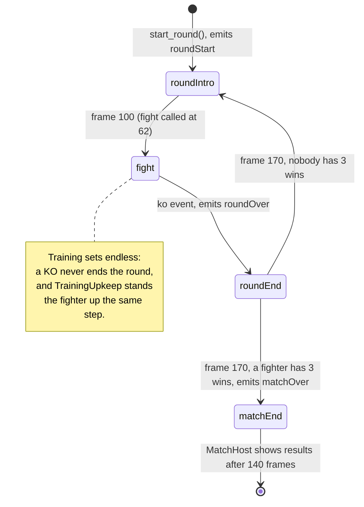

Outside the `fight` phase the world still steps, but with neutral input.

### 6.7 Events

Every rules event is a `Dictionary` with a `"t"` key, emitted in order and drained by `MatchHost` after each step. `events.gd` documents every payload. (`"f"` is a fighter id, not a frame.)

| Group | Events | Emitted by |
| --- | --- | --- |
| Combat | `swing`, `telegraph`, `hit`, `block`, `parry`, `counter`, `evade`, `disarm`, `stagger`, `whiff` | Fighter and World |
| Movement | `dodge`, `jump`, `land`, `step` | Fighter |
| Ultimates | `ultReady`, `ultStart`, `ultChoice`, `ultWave`, `ultDash`, `ultImpale`, `ultBurst`, `ultLightning` | Fighter and World |
| Weapon | `pickup`, `recall`, `weaponStuck` | Fighter and World |
| Follow-up cues | `counterReady`, `backstabReady` | Fighter and World |
| Finisher | `finisherPrompt`, `finisherPromptEnd`, `finisher`, `finisherKill` (and `ko`'s `finisher`) | `FinisherRules` |
| Flow | `roundStart`, `fight`, `ko`, `roundOver`, `matchOver` | Match and World |

`parryEarly` is declared but never emitted.

### 6.8 The computer opponent

`AIBrain` plays through a virtual controller: each frame `think()` returns a `RawInput`, so it obeys the same rules and timing as a human. It reads the live state of both fighters, the world's frame, waves and dropped weapons. Difficulty (`DIFFICULTY`: easy, normal, hard) sets its reaction time, jitter, parry, block, counter and dodge chances, aggression and timing error, and since KE task 9 how it plays a weapon's grips: Easy stays one-handed, Normal switches grip by the situation, Hard also mixes the two strings mid-string, and Normal and Hard sometimes charge a string's heavy ending, the held grip's heavy.

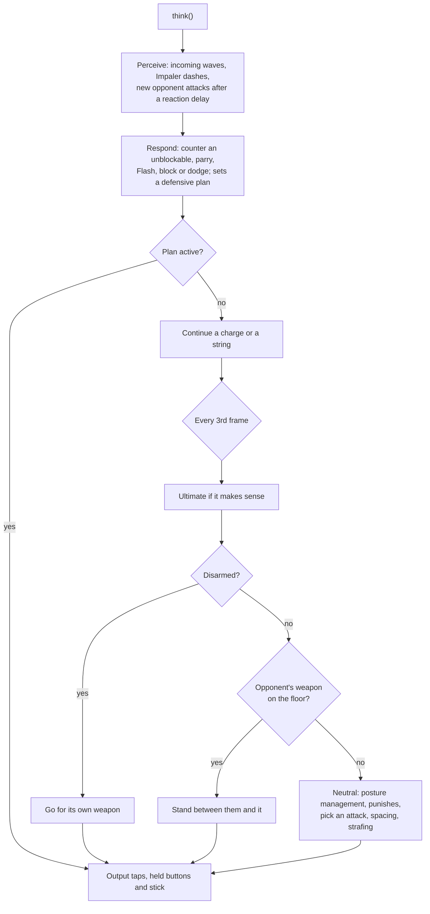

`TrainingBrain` runs a dummy's drill (idle, block, lights, heavies, thrust, sweep, slam, random, fight). For the unblockable drills it swaps the practised ability onto the light slot; `fight` hands over to an internal `AIBrain`.

### 6.9 Tuning

> **Superseded by [ADR 0001](adr/0001-animation-leads-realistic-look.md) (Oct 4, 2026):** This describes the code today. As the slice lands, an attack's frame data and steps come from its clip (generated into a committed table with no hand overrides, with cancels at markers on the clip) and knockback from the reaction clips; the protected timings and jump arcs stay rules numbers.

Global tuning lives in `game/sim/constants.gd` (`SimConst`), weapon frame data in `game/sim/moves`. A few of the numbers that shape the duel:

| Constant | Value | Meaning |
| --- | --- | --- |
| `HP_MAX`, `POSTURE_MAX` | 100, 100 | |
| `ULT_HP_THRESHOLD` | 25 | Ultimate unlocks at or below 25 HP |
| `ROUNDS_TO_WIN` | 3 | |
| `ARENA_RADIUS` | 15 m | Must match every arena's `walkable_radius` |
| `INPUT_BUFFER` | 8 frames | |
| `CHORD_FRAMES` | 4 | Light + heavy for the ultimate |
| `CHARGE_MIN`, `CHARGE_MAX` | 18, 150 frames | A full charge releases itself |
| `PARRY_POSTURE`, `HIT_POSTURE_MULT` | 16, 1.5 | |
| Parry windows | Katana 9, Greatsword 12, Daggers 6, Fists 8 frames | In each weapon's `WeaponDef` |

`finalize_moves()` in `attack_def.gd` fills each move's defaults (its hitstun, blockstun and hit-stop from `ProtectedTimings`: today's, lights' hitstun 14 and heavies' 26, until its family re-keys a Katana or bare-hands move, then the retuned set, lights 24 (bare hands 18) and heavies 41 (35); heavies dodge-cancel from the middle of their recovery; unblockables become undodgeable). The protected timings are frozen: changing one needs the owner's OK. When you change tuning, add or update a test in `game/tests/sim` and update `docs/mvp-spec.md` or the rebuild spec if it records the number.

## 7. Input (`game/input`)

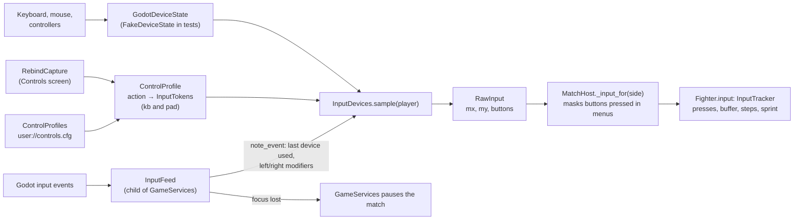

- An **InputToken** is one binding written as a string: `k:<keycode>` (with an optional L or R for modifiers), `m:<button>`, `b:<joy button>`, `a:<axis><+|->`.
- A **ControlProfile** maps each of the 13 actions (`Bindings.ACTIONS`) to up to two tokens, for keyboard and for controller. Defaults come from `Bindings.default_kb()` and `default_pad()`; there is also a fight-stick layout and a fixed arrow-key layout for Versus player 2.
- **InputDevices** owns the per-player device and profile (`set_single_player`, `set_versus`), binds controller seats so unplugging a pad doesn't shift players, and samples a `RawInput`: sticks through a dead-zone curve, triggers past 30/255, buttons on above 0.5.
- **PadStyle** and **BindingLabels** turn tokens into PlayStation, Xbox or generic button names for the HUD and menus. `InputDevices.label(action, player)` names an action's input for the device the player last used, and `on_pad(player)` says whether that is a controller (the HUD's prompts name the stick then).

## 8. Shared services (`game/core`)

| File | What it holds | Used by |
| --- | --- | --- |
| `game_services.gd` (autoload `GameServices`) | The shared `GameSettings`, `ControlProfiles`, `InputDevices`, `InputFeed`, music director and player, UI sounds, and the match being played. `begin_match`/`end_match`, `play_menu_music`, `play_match_music`, `music_event`, `play_ui`. | Nearly everything outside `sim` |
| `game_settings.gd` | Graphics preset, volumes, Reduce flashes and shaking, Button hints and Blood (On, Reduced or Off, milestone-1 task 38), saved to `user://settings.cfg`. Its `changed` signal (emitted by the Settings screen after each change) lets a match follow a change made in the pause menu. With `MONOMACHIA_DEFAULT_SETTINGS=1` (tests, screenshots) the saved file is ignored. | GameServices, graphics applier, `MatchView` (Reduce flashes, Blood), `MatchHud` (Button hints) |
| `match_config.gd` | Everything a match is built from: mode (Duel, Training, Watch, Versus), two `MatchSide`s, arena id, world seed. `default_duel`, `default_training`, `default_watch`, `attract` (all the Hunter mirror with the Katana, crimson against indigo), `next_seed`, `problem()` (validation). | `MatchHost.start()`, main.gd, views, HUD |
| `match_side.gd` | One side: fighter, palette, weapon, abilities, controller (human, computer, dummy), device, profile, difficulty. | MatchHost turns it into a `FighterConfig` plus a brain or a device |
| `roster.gd` | What the menus offer (milestone-1 task 4): the Hunter and the Katana, or the whole roster with `--full-roster` (`Roster.full` in tests). `fighters()`, `weapons()`, `behaviours()` (Training's drills some offered weapon can perform), `offers_side()`. `MatchSide.problem()` checks what exists; this checks what is offered. | The fighter select (grid, weapon cards, Random, preview), `MatchSelection` (random pick, saved picks), How to play's tabs, Training's panel and pause rows, `MatchHost` (the dummy's weapon swaps), the soak |
| `match_results.gd` | Winner, wins, names, weapons and stats for the results screen. | ResultsScreen, smoke run |

## 9. Drawing the match (`game/view`)

### 9.1 `view/match`

| File | Class | What it does |
| --- | --- | --- |
| `match_host.gd` | `MatchHost` | The fixed-step loop (section 5). Signals: `match_started`, `sim_event`, `stepped`, `match_finished`, `pause_changed`, `stopped`, `loadout_changed` (the training dummy swapped weapons; the view and the HUD's plate follow), `training_changed` (the dummy's behaviour or the refill changed), `replay_checked`. Milestone 1: `snapshot()`/`restore()`/`state_hash()` over the world, the match, the brains and Training's upkeep, and `rules_hash()` without the brains; every match played records an `InputLog` (`input_log`, saved to `record_dir`), and `start_replay()` plays one back, comparing its checkpoints. |
| `input_log.gd` | `InputLog` | A match as its inputs (milestone-1 task 6): the config, each step's `RawInput` per side (saved as the doubles' bytes, gzipped, in base64: Godot's text-to-float parsing isn't exact, and a match's inputs repeat a lot), Training's panel actions, the rules' hash every 60 steps and the end. JSON, format 2 (task 28; format 1, the bytes unpacked, still loads); `save_recent()` keeps the newest ten in `user://replays`; `--replay=<log>` (main.gd) plays one. |
| `match_view.gd` | `MatchView` | Loads the arena, builds the two `FighterView`s, draws dropped weapons and contact flashes, drives the camera (in Versus both halves' cameras, `cameras`). Reacts to events with shake, FOV kick, the parry's push-in (`parry_push_in` 0.15, `flash_push_in` 0.25 for a Flash or a redirect; every camera is `frozen` while the rules are in hit-stop) and the KO orbit. Follows Reduce flashes and shaking (`apply_reduce_flashes()`, at match start and on `GameSettings.changed`): shake ×0.15, no FOV kicks or push-ins, flashes and body flashes at 0.45. |
| `../effects/combat_effects.gd`, `effect_table.gd`, `air_smear.gd`, `trail_state.gd` | `CombatEffects`, `EffectTable`, `AirSmear`, `TrailState` | The combat effects, owned by `MatchView` as `effects`, on the effect clock (they hold in hit-stop): pooled flashes, rings, particles, sparks and puffs, and up to three contact lights. `EffectTable` turns a rules event into effects (milestone-1 task 37, spec P39): steel on steel, a block throws a small spray of sparks, a heavy block more, a parry a shower with a white-hot point, a Flash a brighter, longer burst, each with a warm contact light on the presets that allow it (`GraphicsPreset.spark_light`, Ultra and High); a redirect or a bare hand on a blade a dull puff; a hit nothing (blood covers it). Sparks are streaks drawn along their flight (`spark_streak.gdshader`), falling and dying on the floor. Each blade's `AirSmear` (in place of the brush-stroke trails) is a haze ribbon behind its last third (`air_smear.gdshader` bends the scene behind it), as strong as `TrailState` says and as fast as the tip moves, tinted red for unblockables and gold for ultimates. Reduce flashes dims the flashes and sparks and halves the lights. The look test draws the same layer. |
| `../effects/moon_wave.gd` | `MoonWave` | Moonsplitter's wave on screen (milestone-1 task 100), owned by `MatchView` as `moon_waves`: each wave the rules hold (`World.waves`) a curved crescent of moonlight (`shaders/moon_wave.gdshader`: a cold silver leading edge, a wisteria-violet trailing body bending the scene behind it) standing where the rules put it on every drawn frame (`transform_of()`, `alpha` of the way from the step before), with an omni light travelling with it (halved under Reduce flashes) and mist and petals shed behind it on the effects' clock (`shed()`). The vertical stands tall in its lane, the horizontal is a knee-high sheet spanning the arena. |
| `../effects/ult_effects.gd`, `ult_aura.gd` | `UltEffects`, `UltAura` | The disarmed ultimate's effects (task 100): the choice's faint haze and lifted petals, Breaker Palm's pale-gold flash and ring of distortion (`CombatEffects.distortion()`, `shaders/effect_distortion.gdshader`); and the ultimate-ready aura (`UltAura.on()`: ready and not knocked out), its embers thrown with the effects in the side's colour and its rim glow and heat-haze veil shown by `FighterView.show_aura()` (`shaders/ult_rim.gdshader`, `heat_haze.gdshader`). Under Reduce flashes the ultimates' flashes are dimmed and slowed (`CombatEffects.flash_slow`); the aura, steady, is kept. |
| `../effects/recall_flight.gd` | `RecallFlight` | The recalled weapon's flight (milestone-1 task 99, picture only): stuck through the roar, torn out of the ground from the recall's frame 4, then arcing end over end to the owner's right hand by the burst frame; `MatchView` places the dropped weapon by it while its owner recalls. |
| `../effects/blood_effects.gd` | `BloodEffects` | Blood (milestone-1 task 38), drawn by `MatchView` at the settings' Blood level (`apply_blood()`): a burst of drops on each cutting hit (on the effect clock, so it holds in hit-stop), stains on the defender kept in the space of the bone nearest the hit and handed to its materials in world space each frame (`blood_stain.gdshaderinc` in the toon surface), blood along the attacker's Katana blade (`blood_amount`), and floor splatter as decals that fade at the next round's start. Stains and blades last the match; Reduced draws less of each, Off none; Reduce flashes leaves it alone. |
| `camera_rig.gd` | `CameraRig` | FOLLOW (over the shoulder), WATCH (side-on) and MENU (orbit) cameras with damping, arena clamp, shake and FOV kick. `push_in()` (milestone-1 task 39) moves it part of the way to its look point: in over about 3 frames, held while `frozen` (the hit-stop), out over about 0.4 s, with a far blur (`CameraAttributesPractical`) while it is in when `dof_allowed` (the preset's `push_in_dof`); `push_in_scale` scales it. `push_in_held()` and `release_push_in()` (milestone-1 task 98) close in slowly over a given time and hold until released (Moonsplitter's wind-up, released as the wave leaves). `show_shot()` and `end_shot()` (milestone-1 task 97) hand it to a cinematic shot's view and back: the shot's place, look point, lens and depth of field, no push-in or kick, shake at `shake_scale`, the gameplay framing tracked underneath. |
| `shot_director.gd` | `ShotDirector` | The shot director (milestone-1 task 97), owned by `MatchView` as `shots`: `choose()` turns a rules event into a shot (Moonsplitter and Breaker Palm once they hit, never their wind-up; each finisher; the match-winning KO on `roundOver`), the recall's push-in, or nothing; a playing shot gives way only to one ranking as high (a match-winning finisher's shot stands in for the KO shot). It plays on real time and hands back at its length or when the victim's stun ends in world frames; `MatchView` hands its `view()` to every camera, both halves in Versus. |
| `shot_data.gd` | `ShotData` | A cinematic shot's data, one `.tres` per slot in `view/match/shots/`: keyed camera positions and look points (seconds of real time, in the frame of the fighter it is about: the attacker or the winner, or per key in the other fighter's, `positions_on_other` and `looks_on_other`, milestone-1 task 98), fields of view, depth of field, and the motion-blur and colour-fringing flags a look task builds. |
| `match_audio.gd` | `MatchAudio` | Event sounds, footsteps, arena ambience; the listener follows the camera, or in Versus stands between the fighters facing side-on (`versus_listener()`). |
| `split_view.gd` | `SplitView` | Versus split screen (23.6): two `SubViewport` halves sharing the match's world, a divider, neither listening for 3D sound, both in `GraphicsApplier.VIEWPORTS_GROUP`. |
| `stick_pose.gd` | `StickPose` | Stand-in posing: hand positions and blade directions from the rules' state. Task 14.10 replaces it with authored swings. |
| `arena_scenes.gd` | `ArenaScenes` | Arena id → `ArenaDef` → scene, falling back to the stand-in arena if the radius doesn't match the rules. |
| `standin_arena.gd/.tscn` | | A simple code-built arena, used by tests and as the fallback. |

### 9.2 `view/fighter`: from rules state to a moving body

> **Superseded by [ADR 0001](adr/0001-animation-leads-realistic-look.md) (Oct 4, 2026):** This describes the code today. While the game runs a clip is adjusted only by foot locking, the hands' grip on the weapon, mirroring and blending, plus the hit reactions' physical layer. Since milestone-1 task 43 the fighters are drawn in physically based materials (`LookMaterials`).

The rules know only a position, a yaw, a state and a frame. The fighter view turns that into a rigged, animated body.

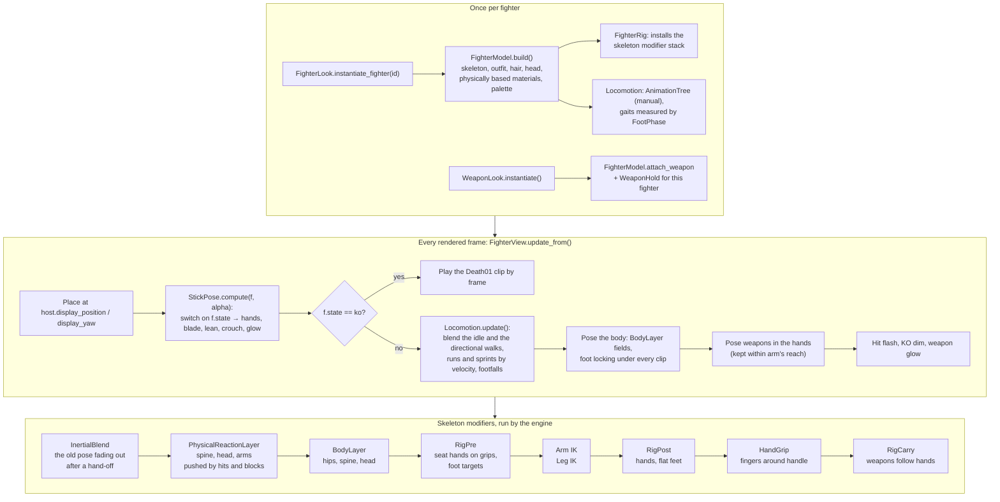

| File | Class | Role |
| --- | --- | --- |
| `fighter_view.gd` | `FighterView` | One side's fighter; runs the per-frame pipeline above. The Katana rides the clip's hands in every state (`CLIP_HELD`, milestone-1 task 135); the other weapons are posed in space outside their clips until task 60. Its body and held weapons carry its side's render layer (`LookPalette.side_layer()`), and in a match it shows its own lights (`show_lights()`). |
| `fighter_lights.gd` | `FighterLights` | Milestone-1 task 44: the fighter's own key and rim light, aimed from the fighter as the look test lit it (the key ahead and to its left, the rim behind and above) and lighting only its side's layer, so neither the arena nor the other fighter catches them; the key's shadows follow the preset (`fighter_shadows`, off on Low). |
| `fighter_rig.gd` | `FighterRig` | Builds the modifier stack; seats hands on weapons. |
| `inertial_blend.gd` | `InertialBlend` | Inertial blending (milestone-1 task 23), the stack's first modifier: on a hand-off the new clip shows whole at once and what is left of the pose shown before (each bone's turn and move, with the speed it had) decays over the blend's frames (`StateClips.blends`, which the director asks for in `Shot.blend`) without overshooting; on the world's time, so hit-stop holds it; picture only. The director no longer crossfades clips. |
| `physical_reaction_layer.gd` | `PhysicalReactionLayer` | The physical reaction layer (milestone-1 task 70), the stack's second modifier: `MatchView.reaction_of()` turns each hit (every part) and block (the arms and upper spine, softer) into a push from its contact point, by its weight and the attacker's weapon class, and `FighterView.react()` hands it to the layer in the skeleton's frame; each bone of the spine, head and arms is a damped spring kicked by it (summed in closed form on the world's time, so hit-stop holds the kick and the same frames give the same pose), the arms pushed less while the fighter's own swing is active; picture only. |
| `body_layer.gd` | `BodyLayer` | Procedural pelvis, spine and head over the clip; takes out a clip's own carry of the hips over the ground (`carried`, milestone-1 task 99: the blasted fall, whose travel the rules already move the fighter by). |
| `locomotion.gd` | `Locomotion` | The packs' directional walk, run and sprint clips blended by the rules' velocity on one shared step phase stepped per rules frame; tap steps, a backwards sprint turned away, the turn on the spot, footfalls at the clips' foot contacts (authored-animation task 29). |
| `foot_phase.gd` | `FootPhase` | Measures each locomotion clip's way, stride, mid-stances and foot contacts once. |
| `pose_check.gd` | `PoseCheck` | Pose quality checks for tools and tests (wrist bend, knee over toes, blade clearance, and with a `FootTrack` over a move's frames, planted feet sliding over 1 cm, milestone-1 task 9). `MoveBench` (`game/tools`) measures every rules frame of a move and names its worst frames. |
| `rig_callback.gd` | `RigCallback` | Lets the rig insert a function into the modifier stack. |

## 10. Fighters, weapons and arenas (content)

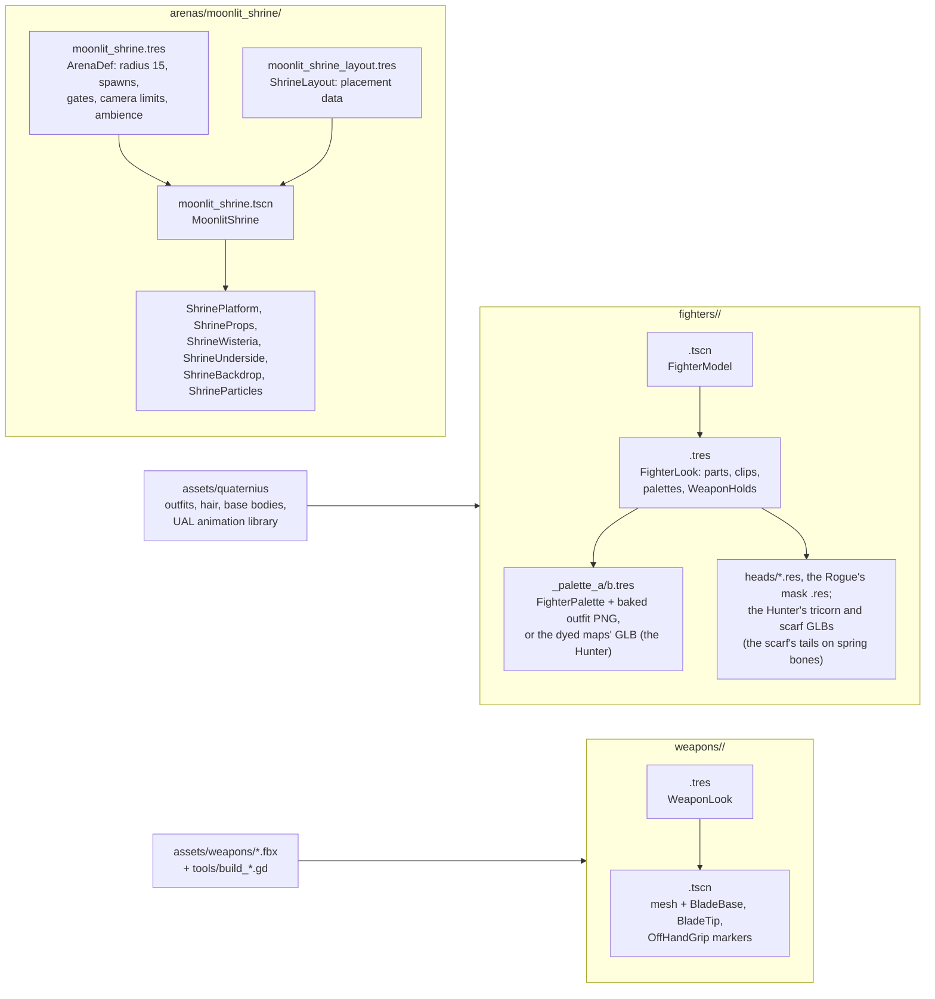

- A **fighter** (Rogue, Hunter) is a `FighterModel` scene plus a `FighterLook` resource. The look says which weapon each fighter holds how (`WeaponHold`: reverse hold, guard stance, wrist tweaks).
- A **weapon's look** (`WeaponLook`) is separate from its rules (`WeaponDef` in `sim/moves`). They share the id (`katana`, `greatsword`, `daggers`) by convention.
- An **arena** is an `ArenaDef` resource plus a scene that builds itself in code. Every arena must provide a `def` property, `Spawn0/1` and `Gate0/1` markers, its own environment (the night, `LookGrade.environment()`) and lights, and apply the graphics preset to itself. Its `walkable_radius` must equal `SimConst.ARENA_RADIUS`, or `ArenaScenes` falls back to the stand-in.
- `fighters/preview/` is a dev stage for looking at fighters and weapons; it isn't part of the game or the export.

## 11. The look: shaders and graphics presets

Milestone-1 task 43 put the game in the realistic look the look test (task 30) settled beside the mood board: physically based materials, dark lighting and volumetric fog under one colour grade, with light film grain. The toon materials, outlines and ink-wash pass, and their tests, are gone. Ultra is the reference preset at 4K and 60 fps on the RTX 3090, High and Medium scale down, and Low must hold 60 fps at 1080p, upscaled, on the Ryzen 7 4700U laptop.

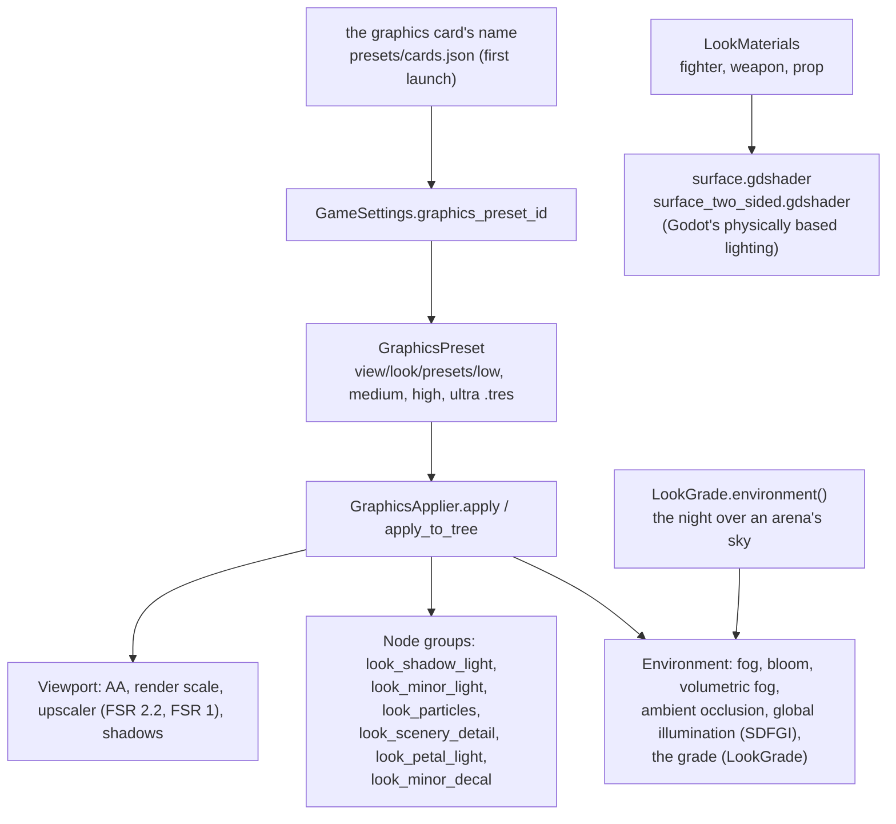

| Shader | Used by |
| --- | --- |
| `surface`, `surface_two_sided` (+ `surface` include) | Fighters, weapons and props, through `LookMaterials`: base colour, texture, normal map, roughness and metalness, and a fighter's blood stains (`blood_stain.gdshaderinc`) |
| `sky_moonlit`, `stone_floor`, `rock`, `cloud_sea`, `mountain_layer`, `lake_water`, `waterfall`, `mist_puff`, `lantern_glow`, `particle_glow`, `particle_flake` | The Moonlit Shrine |
| `weapons/katana/katana_blade` | The Katana's blade (its temper line) |
| `look_noise.gdshaderinc` | Shared noise texture (`LookNoise`), and `look_noise3()` for world-space noise |

Milestone-1 task 29: four presets, Low, Medium, High and Ultra. Ultra (`GraphicsPreset.REFERENCE_ID`, also `DEFAULT_ID`, so tests and shots render at it) is the reference: it renders at 67% of the output and upscales with FSR 2.2, with every atmosphere feature on. The others follow it in every setting but `GraphicsPreset.CUTS`, the resolution and upscaler and the atmosphere (a test holds them to it): High upscales from 59% with FSR 2.2; Medium also drops ambient occlusion and the minor decals; Low renders at 67% with FSR 1 and FXAA (until the laptop bench picks its upscaler) and drops the fighters' key-light shadows (task 44), volumetric fog, the petals' lights, ambient occlusion and the minor decals. Volumetric fog and ambient occlusion come on only where the arena's environment brings them. The first launch (no preset saved) picks a preset from the graphics card's name with `GraphicsPreset.for_card()`, the first matching rule of `presets/cards.json`, and Medium for a card it doesn't know. Bloom is on everywhere (task 43). Anything a preset should be able to turn off joins one of the `look_*` node groups.

## 12. Sound and music (`game/audio`)

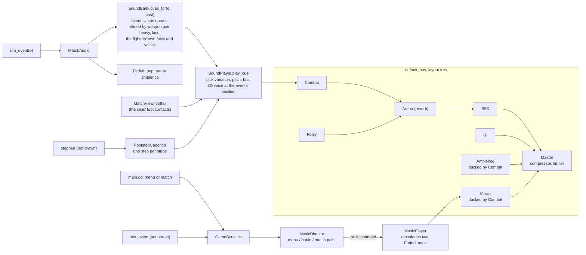

- Sounds are keyed by **cue name** in `SoundBank.CUES`: each cue lists its WAV variations under `assets/audio/sfx/`, volume, pitch range, bus and whether it is 3D. `SoundBank.EVENTS` maps each event type to cues; an empty list means the event is deliberately silent.
- Since milestone-1 task 36, hit, block and parry events name both fighters' weapons (`weapon`, `defender_weapon`), and `SoundBank.PAIR_IMPACTS` picks the impact by the pair that meets (the Katana on the Katana, bare hands against the Katana; other pairs keep the general clangs). A blade hit is the cut, the flesh layer and, on a heavy, the bone. `cues_for(e, cast)` takes each side's fighter id (`MatchAudio.cast()`) and adds that fighter's own cloth and gear (`SoundBank.FOLEY`: the Hunter's) to its swings, dodges, rolls and landings, and `footfall_cues()` under its footsteps; `vocal_moments()` are the hooks of the effort vocals: since task 114 every fighter speaks with `DEFAULT_VOICE` (one male voice, `VOCALS`: kiai, exhale, breath, pain, heavy pain, death), the second side pitched two semitones down (`SIDE_PITCH`). A cue can carry a `chance` (sounding only some of the time) and a `pitch_scale`.
- Since milestone-1 task 136 a steel-on-steel parry also sounds its deflect pair (`SoundBank.DEFLECT_SOUNDS`, by the cut direction each pair names in `state_clips.json`): the parrier's scrape and cloth, the attacker's thrown-back whoosh and stagger. `MatchAudio` picks the pair the clips play (`ClipDirector.pick_pair()`, with or without the clip libraries) once the parry's step is done and starts each cue after its count of the world's frames, so the parry's hit-stop holds them as it holds the clips; a half cut short (the guard back up, a disarm) drops its later cues.
- `SoundPlayer` keeps fixed voice pools and steals the oldest voice when full. Some cues are delayed (the KO gong, the body fall).
- The attract duel is silent. Music changes only from the played match and the menus.
- `tools/sound_check.tscn` is a scene for listening to every cue.
- The WAVs are produced by `scripts/audio` (section 16).

## 13. Screens and the HUD (`game/ui`, `game/scenes`)

The menus are task 22's full set, in the lacquer-and-gold theme (milestone-1 task 53, the mood board's UI A; their layouts are task 22's): `UiTheme.build()` makes the project theme (`ui/theme/lacquer_gold.tres`, saved by `tools/build_ui_theme.gd`) from `UiPalette` and the fonts (Zen Kaku Gothic New for text, Shippori Mincho B1 for titles and buttons, Yuji Boku for brushed kanji; the last two cut down to the characters the game uses by `scripts/fonts.mjs`), and `LacquerPanel` draws its panels. every mode starts through the fighter select, and the main menu also opens How to play, Controls and Settings. Pages sit on a `ScreenStack`, so Back on a page returns to the page that opened it. `test_navigation_walk.gd` walks the whole flow with the keyboard alone and with a controller alone (22.17), and every screen has a `tools/shot_scenes/menu_*.tscn` shot.

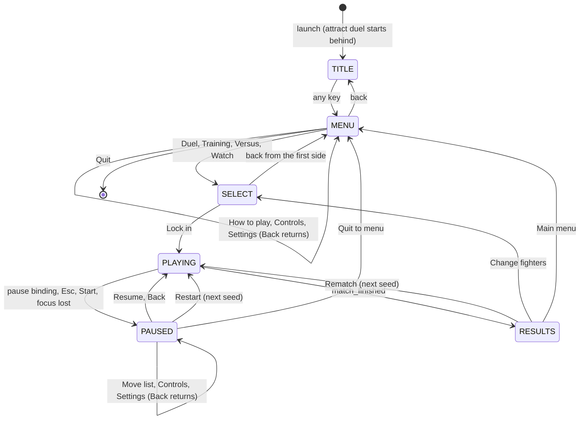

| File | Class | Role |
| --- | --- | --- |
| `scenes/main.gd` | | The screen switcher above; seeds matches; forwards events to the music. |
| `scenes/smoke_run.gd` | `SmokeRun` | `--smoke`: plays Watch to the results, exits 0 or 1. |
| `ui/menus/menu_screen.gd` | `MenuScreen` | A generic menu panel with keyboard, mouse and controller navigation. |
| `ui/menus/title_screen.gd` | `TitleScreen` | "Press any key". |
| `ui/menus/main_menu.gd` | `MainMenu` | Duel, Training, Versus, Watch, How to play, Controls, Settings and Quit, each with its sublabel. |
| `ui/menus/fighter_select.gd` | `FighterSelect` | The select for every mode: the sides one after the other, each with the fighter grid, the loadout panel and the 3D preview; a computer side's skill; in Versus each player's device and Controls profile, a clash or a missing controller refusing Lock in; the arena and Lock in on the last side. Picks go into a `MatchSelection` draft. |
| `ui/menus/how_to_play_screen.gd`, `controls_screen.gd`, `settings_screen.gd` | `HowToPlayScreen`, `ControlsScreen`, `SettingsScreen` | The rules and a move list per weapon; rebinding with capture and profiles; picture and sound. Each also opens over the pause. |
| `ui/menus/pause_screen.gd` | `PauseScreen` | 休止 Paused: Resume, Move list, Controls, Settings, Restart, Quit to menu; in Training, Dummy and Refill health rows above them. |
| `ui/menus/results_screen.gd` | `ResultsScreen` | Winner, rounds, seven stats, Rematch, Change fighters and Main menu. |
| `ui/hud/match_hud.gd/.tscn` | `MatchHud` | HP and posture bars, round pips, ultimate badge (in the lacquer-and-gold style since milestone-1 task 54: `HudBar`, `HudPips`, `HudBadge`), announcements (brushed kanji painted in by `brush_wipe.gdshader`, `AnnouncementEntrance`) and toasts timed on rules steps, the prompts (shown by the Button hints setting), the marker on a dropped weapon, and in Training the `TrainingPanel`. In Versus (23.7) the plates read Player 1 and Player 2, each player's prompts and marker keep to their own half of the split (`prompt_columns`, `weapon_markers`, through `MatchView.cameras`), and the toasts and calls name the player. Hidden in the attract duel. |
| `ui/hud/hud_toasts.gd` | `HudToasts` | The toasts under the centre: `for_event()` says what a rules event toasts from the player's side or Watch's (no nodes); up to three on screen, 69 rules steps each, held by a pause. |
| `ui/hud/hud_prompts.gd`, `key_cap.gd` | `HudPrompts`, `KeyCap` | The prompts at the bottom: `for_fighter()` says what the player can press now (no nodes), at most two, urgent first; each key a `KeyCap` named for the device used last. |
| `ui/hud/weapon_marker.gd` | `WeaponMarker` | "Your weapon" over your dropped weapon as the gameplay camera sees it; `place()` (no nodes) clamps it whole to the screen's edge, pointing the way, when the weapon is off screen or behind the camera. In Versus each player has one ("Player 2's weapon"), kept to their half (`show_in()`). |
| `ui/hud/training_panel.gd` | `TrainingPanel` | Training's panel at the bottom left: "Dummy · <weapon>", the nine behaviour chips (keys 1–9) and refill (key 0), clicks too; a digit bound in the player's profile is left to its action. Follows `MatchHost.training_changed` and `loadout_changed`; hidden while paused. |
| `ui/hud/hud_bar.gd` | `HudBar` | A meter with a lagging band. |

## 14. The web demo (tag `v0.1-web-mvp`)

The web demo's code was deleted in plan task 26.2; tag `v0.1-web-mvp` keeps it (`git checkout v0.1-web-mvp`, or `git show v0.1-web-mvp:src/game.ts` for one file). It has the same shape as the Godot game, because the Godot game was ported from it.

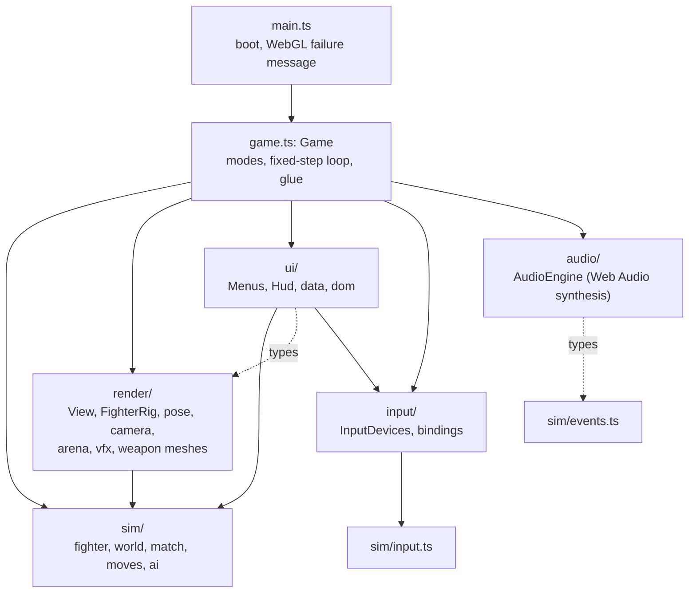

- **Loop.** `Game.loop()` runs on `requestAnimationFrame`: poll devices, handle menu navigation, then the same accumulator as `MatchHost` (at most 6 steps, slow motion scales it). `Game.step()` samples input or asks the brain, calls `match.step()`, drains events and hands them to audio, HUD and view. Unlike Godot, the web demo doesn't interpolate positions; `alpha` only smooths attack poses.
- **Rendering.** `FighterRig` builds a block puppet from primitives with two-bone IK; `computePose()` in `pose.ts` picks a pose from the fighter's state and three keyframes per attack archetype. Versus draws the scene twice into a split screen. If shaders fail, `View` falls back to safer materials in two levels.
- **Sound.** Everything is synthesised with Web Audio at runtime; there are no audio files in the web build.
- **Build.** In the tag, `npm run build` type-checks, builds with `vite-plugin-singlefile` (everything inlined into `dist/index.html`) and runs `scripts/make-artifact.mjs` (adds the three.js licence, writes a page-content variant). The committed `Monomachia.html` is a copy of that build.
- **Saved data** lives in `localStorage`: `monomachia.settings`, `monomachia.profiles.v1`, `monomachia.audio`, `monomachia.lastSelect`.

| Web file (in the tag) | Godot counterpart |
| --- | --- |
| `src/sim/fighter.ts`, `world.ts`, `match.ts`, `input.ts`, `events.ts`, `rng.ts`, `math.ts`, `constants.ts` | `game/sim/fighter.gd`, `world.gd`, `match.gd`, `input_tracker.gd` + `raw_input.gd` + `btn.gd`, `events.gd`, `rng.gd`, `sim_math.gd` + `js_math.gd` + `v2/v3.gd`, `constants.gd` |
| `src/sim/moves/*.ts` | `game/sim/moves/*.gd` |
| `src/sim/ai/brain.ts`, `training.ts` | `game/sim/ai/ai_brain.gd`, `training_brain.gd` |
| `src/game.ts` (loop) | `game/view/match/match_host.gd` |
| `src/game.ts` (modes, menus glue) | `game/scenes/main.gd` |
| `src/render/*` | `game/view/*`, `game/arenas`, `game/fighters`, `game/weapons` |
| `src/input/*` | `game/input/*` |
| `src/ui/hud.ts`, `menus.ts` | `game/ui/hud`, `game/ui/menus` |
| `src/audio/audio.ts` | `game/audio/*` + `scripts/audio/synth.mjs` (its sounds, rendered to WAV) |

## 15. Tests

`npm test` runs two suites: Node's own runner (`node --test`) for the Node tests, then GUT in headless Godot. The web demo's Vitest tests went with it in plan task 26.2. A Node test file is `tests/**/*.test.mjs`, written with `node:test` and `node:assert/strict`; `tests/assert-matches.mjs` adds the one check `node:assert` lacks (a subset match, Vitest's `toMatchObject`).

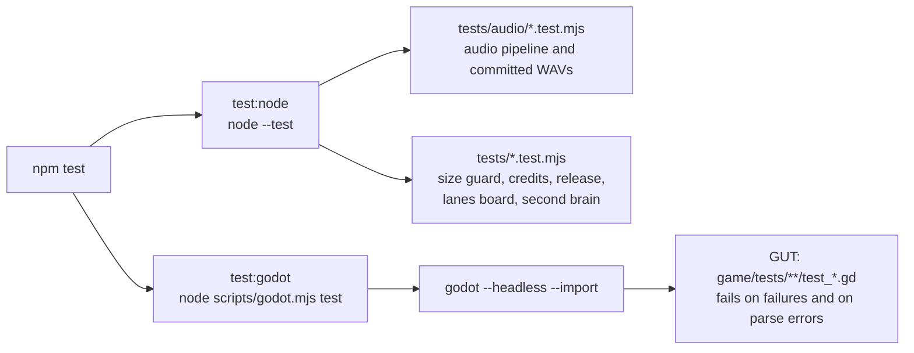

| Folder | Files | What it covers |
| --- | --- | --- |
| `game/tests/` (root) | 2 | Godot version; every scene loads |
| `game/tests/sim` | 16 | Ports of the web rule tests, fixture parity (`rng`, `moves`, `math`, port regressions), fluid combat, each weapon's strings, string continuity, training brain, soak. **Superseded by ADR 0001 (Oct 4):** Tests that pin frame data to the web demo, such as the `moves` fixture parity, will be replaced as the slice lands, and a test will keep every attack inside its timing band. |
| `game/tests/view` | 24 | Arenas, camera, fighter rig and view, stick pose, locomotion, the realistic look (materials, grade, look test), presets, MatchHost, main flow, the `--smoke` run, tool scenes. |
| `game/tests/audio` | 10 | Bus layout and ducking, FadedLoop, footsteps, music director and player, sound bank, sound player, headless playback of a match |
| `game/tests/input` | 7 | Device state, InputFeed, labels, profiles, rebinding, sampling, seats and pause |
| `game/tests/content` | 5 | Animation library, asset hygiene (no art file over 25 MB, textures scaled down, every referenced texture there), fighter scenes, palettes, weapon models. The art's 110 MB cap went in milestone-1 task 8: `check:sizes` holds the size budgets per place. |
| `game/tests/core` | 3 | GameServices, GameSettings, MatchConfig and MatchSide |
| `game/tests/fixtures` | data | JSON from the TypeScript (`rng`, `moves`, `math`, `port`) and a hand-made arena scene |

Rule tests build a `World` directly, feed it scripted `RawInput`s and assert on events and state; `sim_helpers.gd` holds the shared helpers. Nothing graphical is needed. Render checks that need a real window (shaders compile, the look beside the look test) are screenshot scenes in `game/tools/shot_scenes` run by `npm run shots`.

## 16. Tools, scripts and pipelines

### 16.1 npm commands

| Command | What it runs |
| --- | --- |
| `npm test`, `npm run typecheck` | `node --test` and GUT (`test:node`, `test:godot`); the GDScript type check (`tools/typecheck.gd`) |
| `npm run soak -- 40`, `npm run soak:tune` | 40 computer matches in the Godot rules, with the balance report (`soak:tune` runs 300): Hunter-against-Hunter Katana mirrors with random block abilities, the finisher share and the appear-list (milestone-1 task 7); `-- --full-roster` plays random weapon pairs with their win rates |
| `npm run counterlab` | How often the computer lands each unblockable's counter (`tools/counterlab.gd`) |
| `npm run bench` | The frame-time harness (milestone-1 task 28, `tools/bench/frame_time_bench.tscn`): plays the committed worst-case replay in a window at 4K (`--res=`, `--preset=`), after a warm-up pass of the whole log, times every frame of its last 90 s, writes them to `build/bench/` and prints the 99th percentile against the 16.7 ms gate. Owner-run: CI has no GPU |
| `npm run bench:record` | Re-records the worst-case replay (`tools/bench/record_worst_case.gd`): seeded Hard Katana mirrors until one has a 90 s window with Moonsplitter, Breaker Palm and a stretch at the wall; run it when a rules change makes the committed log drift |
| `npm run play`, `npm run dev`, `npm run studio` | Play the game; open the Godot editor; open the Animation Studio |
| `npm run shots -- <scene> <out.png> [frames]` | Render a screenshot in an off-screen window |
| `npm run clip -- <scene> [--seconds N]` | Record a shot scene with Movie Maker as a looping MP4 and a still in `shots/` (`scripts/clip.mjs`, `shot.gd --record`) |
| `npm run post -- <files> [--caption …]` | Publish shots and clips to the session's page in the Project Manager (`tools/lanes-board/post.mjs`; media kept in `~/.claude/lanes-board/media/`, never in the repo) |
| `npm run build` | Export the Windows build to `build/windows/Monomachia.exe`, with `LICENSE.txt`, `CREDITS.txt` and `THIRD-PARTY-NOTICES.txt` beside it (`tools/build_notices.gd`, from the root `LICENSE` and `CREDITS.md`) |
| `npm run release -- <tag> [--no-upload]` | On the PC with the clip libraries: export, `--smoke`, zip and attach to the tag's GitHub release (see section 17) |
| `npm run godot -- script res://tools/x.gd` | Run any headless tool script; `npm run godot -- help` lists the runner's other commands (`import`, `clips`, `bake`…). `clips` builds the clip libraries from the clip manifest: the packs' FBX, and the GLBs of clips exported from Blender (milestone-1 task 13: an entry's `export` path in the asset repository, one export for every clip set, with its pack clip kept as its origin when it replaces one, and `props` keeping the prop bones' motion) |
| `npm run audio:sonniss`, `audio:synth`, `audio:music` | Regenerate sound effects and music |
| `npm run checklist` | Write the last test run's move-by-move results (`build/checklist-results.json`, recorded through `ChecklistResults`) into the per-move checklist, `docs/reviews/milestone-1-checklist.md`; the owner's columns are never touched (milestone-1 task 10) |
| `npm run export` | The Blender export (`scripts/blender/export.mjs` running `export_blend.py` in Blender headless): each source in the asset repository's `blender/sources.json` to one GLB in its `exports/`, with a record of its source and checksums; a clip's keys start at 0 s whatever Blender frame its source starts on, so its frame k plays at k/30 s; clip and fighter sources must carry the Kevin Iglesias rig's bones; self-made and CC0 models are copied into `game/assets/` inside the art budget (the Shrine's five wisteria and their bark, milestone-1 task 48, grown by the asset repository's `blender/shrine/wisteria_build.py` in Blender headless against the Shrine that `game/tools/export_shrine_reference.gd` writes as glTF). A material (milestone-1 task 45, in `materials/`) is a GLB of small planes, one per atlas, each in a material of its maps: the Hunter's crimson and indigo, dyed by `scripts/blender/dye_outfit.py` (Blender headless, one spec per palette in `scripts/blender/dyes/`: Cycles bakes which garment each texel of the Ranger outfit's atlas belongs to and where it sits on the body, then the CC0 maps are recoloured garment by garment, the side's pattern laid on the body in 3D and the cloth worn at the knees and cuffs; the belts and boots reuse the cloth's texels, so they get a neutral gear atlas of their own), land in `game/assets/exports/fighters/`, and `FighterPalette.dyed_material()` gives each outfit mesh its atlas, whose roughness map `LookMaterials` reads. Weapons (milestone-1 task 47, in `weapons/`): the Katana and its saya, built by `scripts/blender/build_katana.py` (Blender headless, from `scripts/blender/weapons/katana.json`: the code-built blade's numbers, the mounting and the saya modelled), land in `game/assets/exports/weapons/`; the Katana's import writes its mesh to `weapons/katana/katana_mesh.res` and draws its blade surface with `materials/blade.tres` (the temper-line shader), the markers in `katana.tscn` standing where its empties do; `Saya` instances the saya and swings its sageo, on the model's own rig, on a `SpringBoneSimulator3D`, tinted by `FighterPalette.cord_color`; `LookMaterials.weapon_from()` carries a modelled weapon's maps. Headwear (milestone-1 task 46, in `headwear/`): the Hunter's tricorn and scarf, built by `scripts/blender/build_headwear.py` (Blender headless) from his head and neck as `game/tools/export_headwear_fit.gd` measures them (`scripts/blender/headwear/hunter_fit.json`), land in `game/assets/exports/headwear/`; `FighterLook.hat_scene` puts the hat's mesh on the Head bone, and `scarf_scene` hangs the scarf, with its own rig, on the Neck bone, where `FighterModel` swings its two tails on a `SpringBoneSimulator3D` against a capsule for the back. A body part (KE task 3) goes out as a `.gltf` and its `.bin` instead, on the Quaternius rig's bones, and lands in the game beside the original part as `<Part>_Tall.gltf`, keeping the original's materials and textures; the parts are re-proportioned for it by `scripts/blender/reproportion_fighter.py` (Blender headless, one spec per fighter in `scripts/blender/bodies/`: the scale about the floor, the shoulders' spread and the head's size baked into each part's rest pose and meshes), which writes the sources into the asset repository's `blender/bodies/`. Claude's scripted re-keys of pack clips are made for it by `scripts/blender/rekey_clip.py` (Blender headless, one spec per clip in `scripts/blender/rekeys/`: the time warp, a real step with the legs on IK, both hands on the grip clear of the body, and for a transition the pose of another clip carried into this one's motion, the feet kept on IK), which writes the source into the asset repository's `blender/clips/` (milestone-1 task 31; the light string's four, tasks 31 and 32; the Katana's guard idle, the bridges between the string's hits and each light's return to guard, task 33, which `state_clips.json`'s `transitions` and `ClipDirector` play; each light's deflect pair, task 34: its recoil, thrown back from the contact, and the deflect aimed so the two blades meet at the rules' contact point, which `state_clips.json`'s `deflects` and `ClipDirector` play; the light hit reactions, turned for their side and lowered for low, and the light block, task 35, which its `reactions` and `own_speed` and `ClipDirector` play) |
| `npm run check:sizes` | Fail on any tracked file over 10 MB, the committed game art over 150 MB or the audio over 40 MB (the spec's size budget table; the asset repository's own budgets are its `tools/check-budgets.mjs`) |
| `npm run brain`, `npm run brain:serve`, `npm run board` | The second brain's generated notes and its viewer; the Project Manager (lanes board) |

### 16.2 The Godot runner (`scripts/godot.mjs`)

Every Godot command goes through this script. It finds Godot from the `GODOT` environment variable, then `godot` or `godot4` on the PATH, then a one-line `.godot-path` file at the repo root (gitignored; a worktree also looks in the main checkout). On Windows point it at the `*_console.exe`. It runs Godot with a watchdog timeout, because a script error in a `--script` run hangs Godot instead of exiting, and it scans the output for `SCRIPT ERROR`, `Parse Error` and `SHADER ERROR`.

### 16.3 Pipelines

```mermaid
flowchart TD
    subgraph AUDIOP["Sound (scripts/audio)"]
        ZIP["Sonniss GDC 2026 bundle zips<br/>(never committed)"] --> EX["extract-sonniss.mjs<br/>picks from sonniss-picks.json"]
        SYN["synth.mjs<br/>web demo's sounds, seeded"]
        MUSP["music.mjs<br/>three 16-bar loops"]
        EX --> SFX["game/assets/audio/sfx/*.wav"]
        SYN --> SFX
        MUSP --> MUSF["game/assets/audio/music/*.wav<br/>+ tracks.json"]
        EX & SYN & MUSP --> SRCMD["game/assets/audio/SOURCES.md"]
    end
    subgraph BLENDP["The Blender export (scripts/blender)"]
        BRK["rekey_clip.py + rekeys/*.json<br/>a pack clip re-timed, stepped and two-handed<br/>(Claude's scripted pass, milestone-1 task 31)"] --> BSRC
        BRP["reproportion_fighter.py + bodies/*.json<br/>a fighter's Quaternius parts re-proportioned<br/>(KE task 3)"] --> BSRC
        BSRC["asset repository: blender/*.blend<br/>listed in blender/sources.json"] --> BEX["export.mjs + export_blend.py<br/>Blender headless"]
        BEX --> BOUT["asset repository: exports/*.glb<br/>+ a record of each source"]
        BEX --> BGAME["game/assets/: self-made and CC0 models<br/>inside the 150 MB art budget"]
        BOUT --> BCLIP["godot.mjs clips (tools/import_clips.gd)<br/>exported clips the clip manifest names, beside the packs' FBX:<br/>retargeted, mirrored, into the gitignored clip libraries"]
    end
    subgraph ARTP["Fighters and weapons (game/tools)"]
        BM["build_bone_map.gd"] --> IA["import_assets.gd<br/>copy chosen Quaternius and weapon files"]
        IA --> IMPRT["godot.mjs import"]
        IMPRT --> BAL["build_animation_library.gd"]
        IMPRT --> CH["cut_heads.gd, build_headwear.gd"]
        IMPRT --> BW["build_pack_weapons.gd<br/>(the Katana's mesh: its export's import)"]
        IMPRT --> BK["bake_palettes.gd, bake_skins.gd"]
    end
```

Other tools in `game/tools`: `soak.gd` and `counterlab.gd` (ports of the TypeScript scripts; counterlab's cases and run are `Counterlab`, `counterlab_run.gd`, which a GUT test runs short), `typecheck.gd`, `shot.gd` (behind `npm run shots`, and `npm run clip` with `--record`), `inspect_scene.gd` (print a model's nodes, bones and clips), `foot_phase.gd` (gait numbers), `move_bench.gd` (play a move frame by frame for tests and contact sheets), `frame_data_generator.gd` (`FrameDataGenerator`, milestone-1 task 15: a clip and its markers at 1.0× into a move's frame data, its swing and its per-frame travel from the hips and foot plants, and a gait clip's speed), `frame_data_rows.gd` (`FrameDataRows`, task 16: the table's rows, band kinds, checksums and text, which `bake_swings.gd` writes with the swing files), `checklist_results.gd` (where tests record per-move checklist results; since task 40 it also names the keyed moves and the clip rows the tests record for, and `test_keyed_checklist.gd` checks the items no other test checks move by move), `bench/` (the frame-time harness: `FrameTimes`, the percentile maths and the frames file; `WorstCase`, the worst-case replay's search and its committed log `worst_case.json`; `frame_time_bench.tscn`; `record_worst_case.gd`), `look_test/` (the look test, milestone-1 task 30: `LookTest`, one fighter in a corner of the Moonlit Shrine in the realistic look under Camera 2's framing, playing the Katana's light string, with its own bench (`npm run bench:look`, 14 ms gate), and `LookMaterials`, which turns toon materials into physically based ones in that scene only, re-lighting each toon-lit shader through `pbr_light.gdshaderinc`; the game keeps the toon look until the art conversion), `foot_contacts.gd` and `measure_feet.gd` (each clip's foot plants and lifts, measured from the clip libraries into the clip manifest), `texel_map.gd` and `js_format.gd` (helpers). `anim_studio/` is the Animation Studio (`npm run studio`): the gallery of live tiles (`gallery/`, `AnimTile`, `StudioCatalogue`) and, since milestone-1 task 25, the editor (`anim_studio/editor/`): `StudioEditor` (a viewport under an `OrbitCamera`, the side panel and the foot-locking toggle), `StudioPlayback` (the playhead over source frames), `StudioTimeline` (the source ruler, the markers, the rules ruler and the feet) and `FramesAndBands` (a move's frame-data table row against its `MoveBands` timing band and distance check); since task 26 `MarkerEdits` (a marker put on a frame, checked as `MoveClips` or `ClipManifest` would check it, into pending edits) and `EditSession` (`anim_studio/edit_session.gd`: the pending edits with undo and redo, and the text a file would be saved as through `SourceEdit`); since task 27 `ChainEdits` (a move's chain as parts and ranges, with no speed or new holds) and `StudioSaver` (`anim_studio/studio_saver.gd`: the clobber check, the atomic write, the frame-data table regenerated by `bake_swings.gd`'s static `bake()` in-process, undone byte for byte if the generator refuses, and the report of changed and out-of-band moves). `game/tools/shot_scenes/` holds the screenshot scenes: arena views, gameplay moments, the look bench, animation contact sheets (`move_sheet`) and the pass/fail render checks. The export excludes `tests/`, `tools/`, `addons/gut/` and `fighters/preview/`.

## 17. CI and releases

```mermaid
flowchart LR
    PUSH["push or pull request"] --> CI1["ci.yml: test<br/>setup Godot 4.7.2, npm ci,<br/>check:sizes, npm test, typecheck,<br/>4-match Godot soak"]
    CI1 --> CI2["ci.yml: export-windows<br/>Godot with export templates,<br/>npm run build"]
    CI2 --> ART2["artifact: Monomachia-windows-stand-in<br/>(STAND-IN.txt inside)"]
    PC["the developer's PC,<br/>with the clip libraries"] --> R1["npm run release -- v0.2.0<br/>checks, export, --smoke, zip"]
    R1 --> R2["gh release upload<br/>Monomachia-v0.2.0-windows.zip<br/>to a draft release"]
```

CI's Windows build is a stand-in: CI has none of the licensed Kevin Iglesias clips, so the build plays the CC0 stand-in clips and carries `STAND-IN.txt` saying so. Releases come only from the PC. `npm run release -- <tag>` (`scripts/godot.mjs`, with its checks and zip in `scripts/release.mjs`) takes a tag of `v` plus `project.godot`'s `config/version` (optionally with a `-suffix`), refuses uncommitted changes to tracked files or a HEAD that isn't on `origin`, exports, plays the exe's `--smoke`, zips the exe with its text files, and uploads the zip to the tag's release, making it a draft release at HEAD if there is none; a person publishes it. Without the clip libraries it only warns: the zip then holds `STAND-IN.txt`. `--no-upload` stops at the zip in `build/release/`. There is no release workflow on GitHub, and the web demo's Pages and release workflows are gone.

## 18. Docs and where work is tracked

```mermaid
flowchart TD
    DESIGN["docs/design.md<br/>the full game: what to build"] --> SPEC["docs/specs/godot-rebuild.md<br/>user stories, decisions, testing"]
    MVP["docs/mvp-spec.md<br/>how the web demo works"] --> SPEC
    SPEC --> PLAN["docs/plans/godot-rebuild.md<br/>phases A-H, tasks, build order, progress"]
    PLAN --> NOTES["docs/plans/godot-rebuild-notes/*<br/>research per area (the plan wins)"]
    PLAN --> CODE["game/"]
    SPIKE["docs/research/animation-spike<br/>can weapon paths animate the fighters?"] --> PLAN
    GLOSS["GLOSSARY.md<br/>the vocabulary"] -.-> DESIGN & SPEC & CODE
    CLAUDE["CLAUDE.md<br/>workflow: spec, plan, implement;<br/>branch and PR per change"] -.-> PLAN
```

> **Superseded by [ADR 0001](adr/0001-animation-leads-realistic-look.md) (Oct 4, 2026):** The rebuild plan's open tasks are triaged against ADR 0001 (look-independent ones finished, tuning and effects moved into the slice plan, toon-only ones retired), and the authored-animation spec closes after its task 30b. The rebuild merges into `master` first, so new work branches from `master` again.

The plan's **build order** runs in 14 stages, one task at a time. Stages 1 to 6 are done (safety nets, the look and real fighters, the shrine, fluid rules, sound and music, the new strings). Stage 7 (swing foundations, where weapon paths drive both the animation and the hit detection) is in progress on its own branch, and stage 8 (the fighter animation core) is partly done. Check the plan's Progress section for the current state rather than this page.

Major features follow `CLAUDE.md`: a spec in `docs/specs/`, a plan in `docs/plans/`, then implementation task by task, each on a branch with a pull request.

## 19. Recipes: where to make common changes

| I want to... | Start here |
| --- | --- |
| Change a move's timing or damage | `game/sim/moves/<weapon>.gd`, then a test in `game/tests/sim`. **Superseded by ADR 0001 (Oct 4):** As the slice lands, an attack's startup, active and recovery come from its clip with no hand overrides, so its timing changes by editing the clip until it lands inside its timing band. |
| Change global tuning (parry, posture, movement) | `game/sim/constants.gd`, then a test, then the docs that record the number |
| Add a rules event | Emit it in `world.gd` or `fighter.gd`, add it to `SimEvents.TYPES` and the header in `events.gd`, then decide its sound (`SoundBank.EVENTS`), HUD text (`match_hud.gd`) and view reaction (`match_view.gd`) |
| Give an event a new sound | A cue in `SoundBank.CUES`, its WAVs from `scripts/audio`, and the mapping in `SoundBank.EVENTS` or `cues_for()` |
| Change how a state looks | `stick_pose.gd` today; the swing and animation tasks (7, 14, 15) replace it |
| Add a fighter | `fighters/<id>/` (scene, `FighterLook`, palettes), `FighterLook.IDS`, and the asset tools |
| Add a weapon's look | `weapons/<id>/` (`WeaponLook`, scene with markers), `WeaponLook.IDS`, holds in each `FighterLook` |
| Add an arena | An `ArenaDef` resource and scene in `arenas/<id>/`, registered in `ArenaScenes.DEFS`; radius must match the rules |
| Add a graphics option | A field on `GraphicsPreset`, the four preset files, and `GraphicsApplier`; a setting the other presets may change from Ultra's joins `GraphicsPreset.CUTS`. |
| Add a binding or action | `Bindings.ACTIONS`, `ACTION_BUTTON`, the default sets, `Btn` if it is a new rules button |
| Add a screen | Build it in `ui/menus`, switch to it from `scenes/main.gd` (task 22 reworks this) |
| Check the balance after a change | `npm run soak -- 40` |
| See a change | `npm run play`, or a screenshot with `npm run shots` |

## 20. Traps

- **Keep the rules headless.** No `Node`, scene, rendering, audio or `Input` in `game/sim`. Tests and the soak depend on it.
- **Determinism.** Don't use Godot's `randf()`, `Vector3`, `sin` or `round` in the rules. Use `Rng`, `V3`, `JsMath` and `SimMath.js_round`. They exist because Godot's float32 vectors and C-runtime maths differ in the last bit from V8, which made the port drift. Keep random draws in a fixed order (a short-circuited condition that skips a draw changes every later one).
- **Update order matters.** Fighter 0 updates before fighter 1; ultimate hits are queued until both have updated; combat outcomes are all decided before any is applied. Changing any of these changes results.
- **Frames, not seconds.** Every rules duration is in 60 Hz frames. `SimConst.FPS` and `DT` are the only clock.
- **The view must not write to the rules.** Read `host.fighter(i)` and react to `sim_event`; never set a fighter's fields from the view, HUD or audio.
- **Reference cycles.** `World` and the brains have `dispose()` to break `RefCounted` cycles (fighter ↔ opponent ↔ world). Call it when throwing a match away; `MatchHost.stop()` does.
- **Godot's JSON and float literals round differently from V8**, which is why the parity fixtures store floats as hex bit patterns and `JsMath` builds its constants from bits.
- **GUT skips a test file that doesn't parse**, silently. `godot.mjs test` fails on parse errors for that reason; keep it that way.
- **Saved settings leak into tests.** Tests and screenshots set `MONOMACHIA_DEFAULT_SETTINGS=1`, so they start from the default settings and one fresh controls profile, and never write the player's files. Do the same in any new runner.
- **Big files.** `check:sizes` fails CI on any tracked file over 10 MB, the committed game art over 150 MB or the audio over 40 MB. Never commit the raw Sonniss recordings.
- **`docs/adr/` doesn't exist yet**, although `docs/agents/domain.md` mentions it. Create it with the first ADR.
  > **Superseded by [ADR 0001](adr/0001-animation-leads-realistic-look.md) (Oct 4, 2026):** `docs/adr/` now exists, and ADR 0001 is its first record.
