# Monomachia: a map of the code

Oct 2, 2026 · written at commit `9205183` on `feature/godot-rebuild`

> **Superseded by [ADR 0001](adr/0001-animation-leads-realistic-look.md) (Oct 4, 2026):** This page still maps the code as it stood on Oct 2. Under ADR 0001, an attack's frame data and footwork come from its clip, a realistic look replaces the toon and ink-wash look, and the RTX 3090 is the target; the sections marked with it are replaced as the slice lands.

This is a guide for a developer who is new to the repository. It shows what each folder holds, how the pieces connect, and how one frame of a duel flows from a button press to a sound. The diagrams are Mermaid and render on GitHub.

It describes the code, not the game. For the game's rules and vision read `docs/design.md`, for the web demo's spec `docs/mvp-spec.md`, for the Godot rebuild `docs/specs/godot-rebuild.md` and `docs/plans/godot-rebuild.md`, and for the vocabulary `GLOSSARY.md`. Where this page names a concept (Fighter, Weapon, Posture, Parry, Counter and so on) it uses the glossary's meaning.

Line numbers drift, so this page names files and functions rather than lines. Search for the function name.

## Contents

1. [Two games in one repository](#1-two-games-in-one-repository)
2. [The repository at a glance](#2-the-repository-at-a-glance)
3. [The Godot game: layers and rules of thumb](#3-the-godot-game-layers-and-rules-of-thumb)
4. [Boot and the scene tree](#4-boot-and-the-scene-tree)
5. [One frame, end to end](#5-one-frame-end-to-end)
6. [The rules (`game/sim`)](#6-the-rules-gamesim)
7. [Input (`game/input`)](#7-input-gameinput)
8. [Shared services (`game/core`)](#8-shared-services-gamecore)
9. [Drawing the match (`game/view`)](#9-drawing-the-match-gameview)
10. [Fighters, weapons and arenas (content)](#10-fighters-weapons-and-arenas-content)
11. [The look: shaders and graphics presets](#11-the-look-shaders-and-graphics-presets)
12. [Sound and music (`game/audio`)](#12-sound-and-music-gameaudio)
13. [Screens and the HUD (`game/ui`, `game/scenes`)](#13-screens-and-the-hud-gameui-gamescenes)
14. [The web demo (`src/`)](#14-the-web-demo-src)
15. [Tests](#15-tests)
16. [Tools, scripts and pipelines](#16-tools-scripts-and-pipelines)
17. [CI and releases](#17-ci-and-releases)
18. [Docs and where work is tracked](#18-docs-and-where-work-is-tracked)
19. [Recipes: where to make common changes](#19-recipes-where-to-make-common-changes)
20. [Traps](#20-traps)

---

## 1. Two games in one repository

The repository holds the same duel twice:

| | Web demo | Godot rebuild |
| --- | --- | --- |
| Folder | `src/`, `tests/`, `index.html` | `game/` |
| Language and engine | TypeScript, three.js, Vite | GDScript, Godot 4.7 (Forward+, Jolt physics) |
| Status | Finished MVP. Frozen; retired once the Godot build matches it (plan task 26). | In active build, stage by stage (see `docs/plans/godot-rebuild.md`). |
| Output | One self-contained HTML file | A Windows program |
| Fighters | Block puppets posed by code | Rigged Quaternius fighters (Rogue, Hunter) |
| Sound | Synthesised in code at runtime | WAV files from the Sonniss bundle plus generated ones |

The Godot rules in `game/sim` started as a line-for-line port of `src/sim`, checked bit for bit against the TypeScript up to commit `4222167`. Since then the rules have changed on purpose (fluid combat, new strings), so the two no longer match. **New work goes into `game/`.** Touch `src/` only to keep the web build and its tests passing.

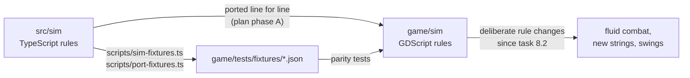

## 2. The repository at a glance

```mermaid
flowchart TD
    ROOT["monomachia/"]
    ROOT --> GAME["game/<br/>Godot 4.7 project"]
    ROOT --> SRC["src/<br/>web demo, TypeScript + three.js"]
    ROOT --> TESTS["tests/<br/>Vitest: web rules, audio pipeline, size guard"]
    ROOT --> SCRIPTS["scripts/<br/>Node tooling: Godot runner, soak, fixtures, audio generation"]
    ROOT --> DOCS["docs/<br/>design, specs, plans, research"]
    ROOT --> GH[".github/workflows/<br/>CI, release, Pages"]
    ROOT --> META["CLAUDE.md, README.md, GLOSSARY.md,<br/>package.json, vite.config.ts, tsconfig.json,<br/>Monomachia.html (built web demo)"]

    GAME --> G_SIM["sim/ rules, no graphics"]
    GAME --> G_INPUT["input/ devices, bindings, profiles"]
    GAME --> G_CORE["core/ GameServices autoload, settings, match config"]
    GAME --> G_VIEW["view/ match host, camera, fighter animation, look"]
    GAME --> G_AUDIO["audio/ sound bank, players, music"]
    GAME --> G_UI["ui/ HUD and menus"]
    GAME --> G_SCENES["scenes/ main.tscn, main.gd, smoke run"]
    GAME --> G_CONTENT["fighters/ weapons/ arenas/ shaders/"]
    GAME --> G_ASSETS["assets/ Quaternius models, audio, weapon sources"]
    GAME --> G_TOOLS["tools/ headless scripts, screenshot scenes"]
    GAME --> G_TESTS["tests/ GUT tests"]
    GAME --> G_ADDONS["addons/gut/ test framework (vendored)"]
```

| Folder | What it holds |
| --- | --- |
| `game/sim` | The rules: fighters, world, match, moves, AI. Pure `RefCounted` objects, stepped 60 times per second, no nodes or rendering. |
| `game/sim/moves` | Frame data for each weapon (`katana.gd`, `greatsword.gd`, `daggers.gd`, `fists.gd`), the `AttackDef` and `WeaponDef` records and the `Moves` registry. |
| `game/sim/ai` | `AIBrain` (the computer opponent) and `TrainingBrain` (the training dummy). |
| `game/input` | Reading keyboards, mice and controllers into a `RawInput` per player; bindings, profiles, rebinding, button labels. |
| `game/core` | `GameServices` (the only autoload), `GameSettings`, `MatchConfig`, `MatchSide`, `MatchResults`. |
| `game/view/match` | `MatchHost` (the fixed-step loop), `MatchView`, `CameraRig`, `MatchAudio`, `StickPose`, the arena registry. |
| `game/view/fighter` | Animating a rigged fighter from the rules' state: the clip director, locomotion, foot locking, IK rig. |
| `game/view/look` | Toon materials, outline, ink-wash post pass, colour grade, graphics presets. **Superseded by ADR 0001 (Oct 4):** This is the code today; as the slice lands, a realistic look (physically based materials under a painterly colour grade) replaces the toon materials, outlines and ink-wash pass, and four presets with Ultra as the reference preset replace today's three. |
| `game/view/mesh_kit*.gd` | Procedural mesh building for props and stand-ins. |
| `game/fighters`, `game/weapons`, `game/arenas` | Content: fighter models and palettes, weapon models, the Moonlit Shrine. |
| `game/shaders` | Every `.gdshader` and shared include. |
| `game/audio` | `SoundBank` (event to sound table), `SoundPlayer`, music director and player, footsteps. |
| `game/ui` | `MatchHud`, `HudBar`, `MenuScreen`, `TitleScreen`, `ResultsScreen`. |
| `game/scenes` | `main.tscn` and `main.gd` (the screen flow) and `smoke_run.gd` (the `--smoke` check). |
| `game/tools` | Headless scripts: soak, typecheck, screenshots, asset builders and bakers. |
| `game/tests` | GUT tests, by area. |
| `src/` | The web demo (section 14). |
| `scripts/` | Node scripts behind the `npm run` commands (section 16). |

## 3. The Godot game: layers and rules of thumb

Three rules hold the code together:

1. **The rules never depend on the presentation.** Nothing in `game/sim` or `game/input` refers to a view, audio, UI or content class. The view, HUD and audio read the rules' state and listen to its events, but never change it.
2. **The rules never see the wall clock.** Every duration in `game/sim` is in frames at 60 per second. `MatchHost` turns real time into steps.
3. **The rules are deterministic.** Same seed, same inputs, same match. Randomness comes only from `Rng` (seeded per match and per AI), and the order of updates is fixed.

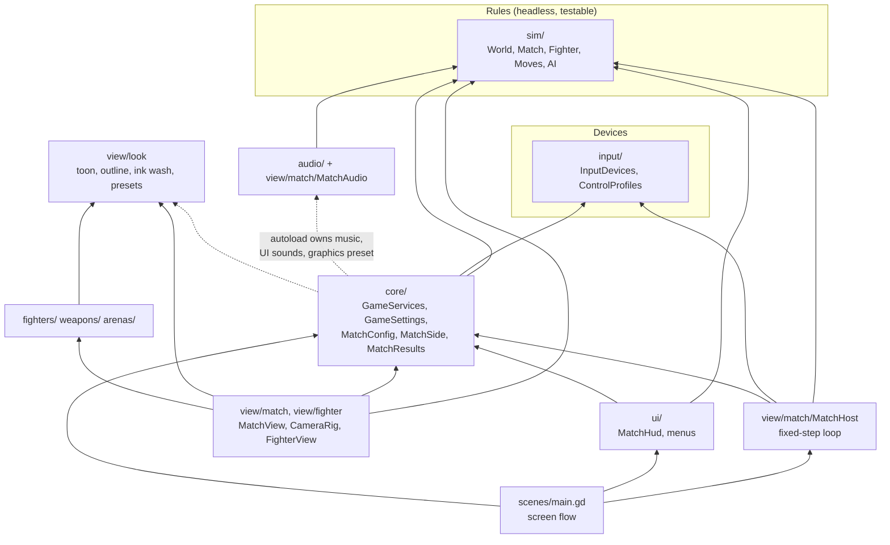

The dotted arrows are the one place the layering bends: the `GameServices` autoload creates the music player and UI sound player, and applies the graphics preset, so `core` refers to `audio` and `view/look`. Nothing in `sim` or `input` does.

The rules talk to everything else through exactly three channels, all on `MatchHost`:

- the `sim_event(e: Dictionary)` signal, once per rules event, in the order the world emitted them;
- the `stepped(step)` signal, after each rules step;
- read-only access to `host.fighter(i)`, `host.world` and `host.sim_match`.

## 4. Boot and the scene tree

`project.godot` sets `res://scenes/main.tscn` as the main scene and registers one autoload, `GameServices`. It defines no gameplay input actions: all gameplay input goes through `game/input`. Menus use Godot's built-in `ui_*` actions. The 60 Hz rate does not come from Godot's physics tick; `MatchHost` keeps its own accumulator.

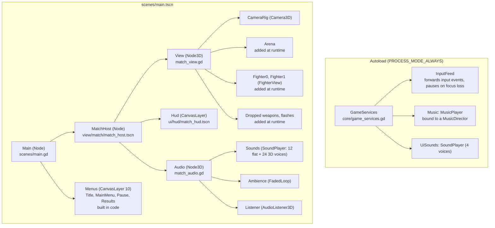

At startup `main.gd` builds the menu screens, connects to the host's signals, starts the **attract duel** (a computer-versus-computer match playing silently behind the title and menus) and shows the title. With `--smoke` on the command line it instead plays a Watch match to the results and quits with the outcome; CI uses this to check the exported game.

Signal handlers run in the order they were connected. Children run `_ready` before their parent, so every `sim_event` reaches the View first, then the HUD, then the Audio, then `main.gd`.

## 5. One frame, end to end

`MatchHost` (`view/match/match_host.gd`) is the heart of the game. Each rendered frame it adds the frame's time (capped at 0.1 s and scaled by the rules' slow motion, `world.time_scale()`) to an accumulator and takes one rules step per 1/60 s in it, at most six per frame; past that it drops the backlog. Tests and the smoke run skip the clock and call `step(n)`.

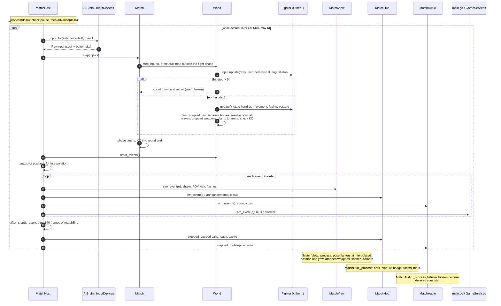

**Interpolation.** The host keeps each fighter's position and yaw from before and after the last step. `display_position(i)` and `display_yaw(i)` blend them by `alpha()`, the fraction of a step left in the accumulator. During hit-stop `alpha()` holds at 1 so poses don't jitter, and a `roundStart` event places fighters instead of blending them.

**Pause.** The pause binding, Esc, Start or the window losing focus calls `host.pause()`; `pause_changed` opens the pause menu (`PauseScreen`) and holds the match's sounds. The same press resumes, unless a screen is open over the pause menu (Move list, Controls, Settings): `main.gd` then turns `host.pause_press_resumes` off, so Esc is only that screen's Back. A rules button pressed in a menu is ignored by the match until it is let go, so pressing A to resume doesn't also jump, and a profile picked in the pause's Controls is taken up on resume.

## 6. The rules (`game/sim`)

Every file in `game/sim` says in its header which `src/sim/*.ts` file it was ported from.

### 6.1 Files

| File | Class | What it is |
| --- | --- | --- |
| `match.gd` | `Match` | Rounds and the match: phases, wins, the round call. Owns the `World`. |
| `world.gd` | `World` | Both fighters, dropped weapons and Moonsplitter waves; resolves every hit. Emits events. |
| `fighter.gd` | `Fighter` | One fighter's state machine: movement, guard, attacks, dodges, counters, disarm, ultimates. The biggest file. |
| `attack_state.gd` | `AttackState` | The attack in progress: its `AttackDef`, frame, charge, queued follow-up, lunge. |
| `dodge_state.gd` | `DodgeState` | The dodge or backstep in progress: direction, distance, invulnerable frames. |
| `ult_state.gd` | `UltState` | The ultimate in progress: kind, phase, frames in phase. |
| `fighter_config.gd` | `FighterConfig` | What a fighter is built from: weapon, abilities, name. |
| `fighter_stats.gd` | `FighterStats` | Per-match counters for the results screen. |
| `dropped_weapon.gd` | `DroppedWeapon` | A weapon knocked out of a fighter's hands, tumbling then lying on the floor. |
| `slash_wave.gd` | `SlashWave` | A Moonsplitter wave travelling across the arena. |
| `events.gd` | `SimEvents` | The list of event types and their payloads (documented in its header). |
| `input_tracker.gd` | `InputTracker` | Turns each frame's `RawInput` into presses, releases, an 8-frame buffer, steps and sprint. |
| `raw_input.gd` | `RawInput` | One frame of input: stick `mx`, `my` and a button bitmask. |
| `btn.gd` | `Btn` | Button indices: LIGHT, HEAVY, BLOCK, DODGE, JUMP, INTERACT, ULTIMATE, SPRINT. |
| `constants.gd` | `SimConst` | Global tuning. |
| `sim_math.gd` | `SimMath` | Angles, easing, `js_round`. |
| `js_math.gd` | `JsMath` | V8-exact `sin`, `cos`, `atan2`, `hypot` (see [Traps](#20-traps)). |
| `rng.gd` | `Rng` | Mulberry32, bit-exact with the TypeScript. |
| `v2.gd`, `v3.gd` | `V2`, `V3` | 64-bit vectors (Godot's `Vector3` is 32-bit). |
| `moves/attack_def.gd` | `AttackDef` | One move's frame data and flags; `finalize_moves()` fills defaults. |
| `moves/weapon_def.gd` | `WeaponDef` | One weapon: class, speed, parry window, block mitigation, its moves and which move starts each context. |
| `moves/moves.gd` | `Moves` | The registry: `WEAPONS`, `PLAYABLE_WEAPONS`, `COUNTER_LUNGE`, `ULT_HITS`, `get_move()`. |
| `moves/katana.gd`, `greatsword.gd`, `daggers.gd`, `fists.gd` | `KatanaMoves` and so on | Each weapon's `MOVES` table and `build()`. Fists is the bare-hands moveset. |
| `ai/ai_brain.gd` | `AIBrain` | The computer opponent. |
| `ai/training_brain.gd` | `TrainingBrain` | The training dummy's drills. |
| `training_upkeep.gd` | `TrainingUpkeep` | Training's upkeep, stepped by the host after each rules step: getting up after a K.O., the refill (90 frames unhurt, then 2 HP a frame, the dummy's posture draining as fast), the dummy re-arming after 240 frames disarmed. `weapon_for()` and `swap_dummy_weapon()` give the dummy a weapon that can perform a behaviour. |

### 6.2 Data model

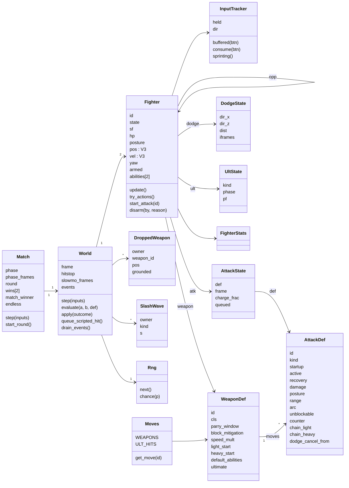

### 6.3 A rules step

`World.step(inputs)` runs this order every frame. The order is part of the rules: changing it changes outcomes.

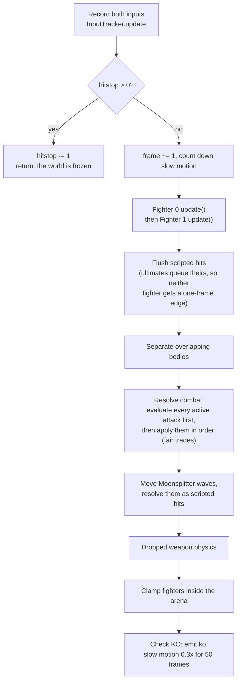

Inside `Fighter.update()`: count the frame in the state (`sf`), handle a block press (open the parry window, shrinking it for mashing), run the current state's handler (which may call `try_actions()`), integrate movement, turn to face, regenerate posture, and announce `ultReady` once.

`try_actions()` picks the player's action in this priority: ultimate (button or light + heavy within 4 frames), block ability (block + light or heavy), pick up weapon, dodge (backstep with no direction), jump, light or heavy (chosen by context: counter-lunge window, in the air, sprinting, after a dodge or backstep, or the normal starter), then a step on a fresh stick push.

### 6.4 What a swing does when it connects

`World.evaluate(attacker, target, def)` decides one outcome; the first matching check wins. `World.apply()` then applies it.

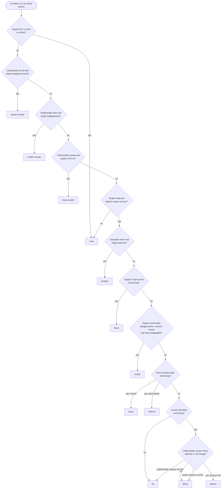

| Outcome | Effect |
| --- | --- |
| hit | Damage (×1.8 at full charge, ×1.6 for a backstab), posture ×1.5, hitstun and knockback, or KO. |
| block | Posture by the weapon's block mitigation (or the move's guard crush), blockstun, knockback. |
| parry, flash, redirect | The attacker takes posture and recoils (parry) or is stunned (flash, redirect). An attacker whose posture is full is disarmed (or dazed if already bare-handed). |
| stomp, leap, evade counter | The attacker is stunned or loses recovery; the defender gets the counter move or a counter-lunge window. |
| disarm | The defender's weapon flies off as a `DroppedWeapon`; posture resets. |
| evade, jumped, miss | Nothing lands. |

### 6.5 Fighter states

`Fighter.STATES` lists 24 states. `set_state(s, dur)` resets the frame counter and clears the attack, dodge or ultimate data that the new state doesn't use. `to_free()` returns to `jump` if airborne, else `free`. A fighter can block and parry from `free`, `step`, `blockstun`, `land`, `parryAnim`, and late `recoil`.

```mermaid
stateDiagram-v2
    [*] --> intro : round starts
    intro --> free : frame 100

    state "Neutral and movement" as neutral {
        free --> step : stick tap
        step --> free
        free --> dodge : dodge with a direction
        free --> backstep : dodge, no direction
        dodge --> free
        backstep --> free
        free --> jump : jump
        jump --> land : touches the ground
        land --> free
    }

    free --> attack : light, heavy or block ability
    jump --> attack : air attack
    dodge --> attack : follow-up after the invulnerable frames
    attack --> attack : queued follow-up
    attack --> dodge : dodge cancel
    attack --> free : recovery ends

    free --> blockstun : blocked a hit
    blockstun --> free
    free --> parryAnim : parried
    parryAnim --> free
    attack --> recoil : was parried
    recoil --> free
    attack --> stunned : flashed, redirected or countered
    stunned --> free
    free --> hitstun : was hit
    hitstun --> free
    free --> disarmStagger : disarmed
    disarmStagger --> free
    free --> stagger : bare-handed, posture full
    stagger --> free

    dodge --> stomp : stomp counter
    jump --> leap : leap counter
    stomp --> free
    leap --> free

    free --> pickup : interact on own weapon
    pickup --> free : re-armed

    free --> ult : ultimate, armed
    free --> ultChoice : ultimate, bare hands
    ultChoice --> recall : light or timeout
    ultChoice --> attack : heavy (Breaker Palm)
    recall --> free
    ult --> free
    free --> impaled : caught by Impaler
    impaled --> hitstun

    free --> ko : HP 0
    free --> victory : won the round
    ko --> [*]
    victory --> [*]
```

The diagram draws reactions from `free` for readability; most reactions can start from any state the hit lands in.

The three ultimates run their own phases inside the `ult` state:

| Ultimate | Weapon | Phases |
| --- | --- | --- |
| Moonsplitter | Katana | windup (stick picks vertical or horizontal) → release (spawns a `SlashWave`) |
| Impaler | Greatsword | aim → dash (scripted hit `u_impale`) → impale → burst on heavy (`u_burst`) → recover |
| Lightning Tempest | Daggers | flash (invulnerable dash) → six spins (`u_tempest`) → final (`u_tempest_final`) → recover |

### 6.6 Match phases

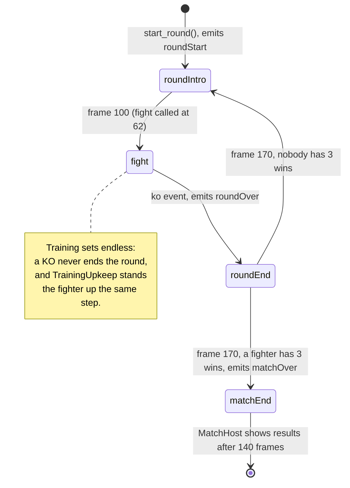

Outside the `fight` phase the world still steps, but with neutral input.

### 6.7 Events

Every rules event is a `Dictionary` with a `"t"` key, emitted in order and drained by `MatchHost` after each step. `events.gd` documents every payload. (`"f"` is a fighter id, not a frame.)

| Group | Events | Emitted by |
| --- | --- | --- |
| Combat | `swing`, `telegraph`, `hit`, `block`, `parry`, `counter`, `evade`, `disarm`, `stagger`, `whiff` | Fighter and World |
| Movement | `dodge`, `jump`, `land`, `step` | Fighter |
| Ultimates | `ultReady`, `ultStart`, `ultChoice`, `ultWave`, `ultDash`, `ultImpale`, `ultBurst`, `ultLightning` | Fighter and World |
| Weapon | `pickup`, `recall`, `weaponBounce` | Fighter and World |
| Follow-up cues | `counterReady`, `backstabReady` | Fighter and World |
| Flow | `roundStart`, `fight`, `ko`, `roundOver`, `matchOver` | Match and World |

`parryEarly` is declared but never emitted.

### 6.8 The computer opponent

`AIBrain` plays through a virtual controller: each frame `think()` returns a `RawInput`, so it obeys the same rules and timing as a human. It reads the live state of both fighters, the world's frame, waves and dropped weapons. Difficulty (`DIFFICULTY`: easy, normal, hard) sets its reaction time, jitter, parry, block, counter and dodge chances, aggression and timing error.

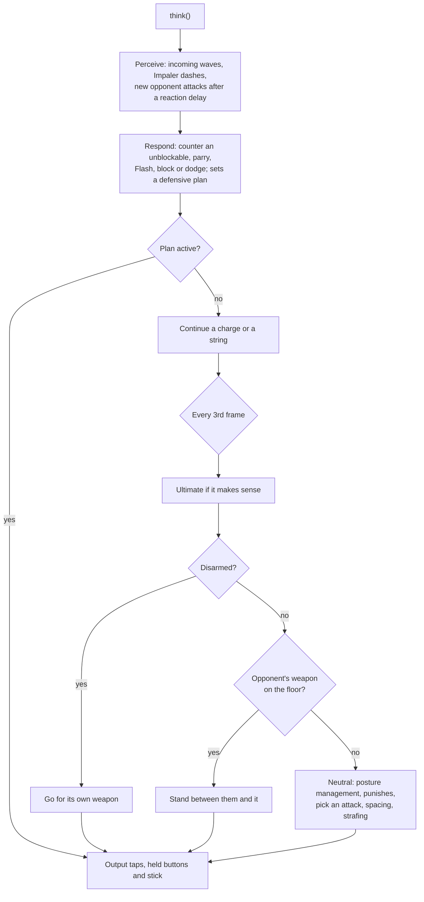

`TrainingBrain` runs a dummy's drill (idle, block, lights, heavies, thrust, sweep, slam, random, fight). For the unblockable drills it swaps the practised ability onto the light slot; `fight` hands over to an internal `AIBrain`.

### 6.9 Tuning

> **Superseded by [ADR 0001](adr/0001-animation-leads-realistic-look.md) (Oct 4, 2026):** This describes the code today. As the slice lands, an attack's frame data and steps come from its clip (generated into a committed table with no hand overrides, with cancels at markers on the clip) and knockback from the reaction clips; the protected timings and jump arcs stay rules numbers.

Global tuning lives in `game/sim/constants.gd` (`SimConst`), weapon frame data in `game/sim/moves`. A few of the numbers that shape the duel:

| Constant | Value | Meaning |
| --- | --- | --- |
| `HP_MAX`, `POSTURE_MAX` | 100, 100 | |
| `ULT_HP_THRESHOLD` | 25 | Ultimate unlocks at or below 25 HP |
| `ROUNDS_TO_WIN` | 3 | |
| `ARENA_RADIUS` | 15 m | Must match every arena's `walkable_radius` |
| `INPUT_BUFFER` | 8 frames | |
| `CHORD_FRAMES` | 4 | Light + heavy for the ultimate |
| `CHARGE_MIN`, `CHARGE_MAX` | 18, 150 frames | A full charge releases itself |
| `PARRY_POSTURE`, `HIT_POSTURE_MULT` | 16, 1.5 | |
| Parry windows | Katana 9, Greatsword 12, Daggers 6, Fists 8 frames | In each weapon's `WeaponDef` |

`finalize_moves()` in `attack_def.gd` fills each move's defaults (hitstun light 14, heavy 26; heavies dodge-cancel from the middle of their recovery; unblockables become undodgeable). When you change tuning, add or update a test in `game/tests/sim` and update `docs/mvp-spec.md` or the rebuild spec if it records the number.

## 7. Input (`game/input`)

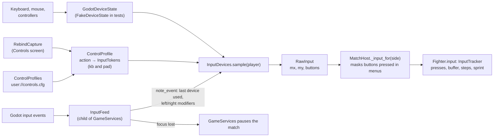

- An **InputToken** is one binding written as a string: `k:<keycode>` (with an optional L or R for modifiers), `m:<button>`, `b:<joy button>`, `a:<axis><+|->`.
- A **ControlProfile** maps each of the 13 actions (`Bindings.ACTIONS`) to up to two tokens, for keyboard and for controller. Defaults come from `Bindings.default_kb()` and `default_pad()`; there is also a fight-stick layout and a fixed arrow-key layout for Versus player 2.
- **InputDevices** owns the per-player device and profile (`set_single_player`, `set_versus`), binds controller seats so unplugging a pad doesn't shift players, and samples a `RawInput`: sticks through a dead-zone curve, triggers past 30/255, buttons on above 0.5.
- **PadStyle** and **BindingLabels** turn tokens into PlayStation, Xbox or generic button names for the HUD and menus.

## 8. Shared services (`game/core`)

| File | What it holds | Used by |
| --- | --- | --- |
| `game_services.gd` (autoload `GameServices`) | The shared `GameSettings`, `ControlProfiles`, `InputDevices`, `InputFeed`, music director and player, UI sounds, and the match being played. `begin_match`/`end_match`, `play_menu_music`, `play_match_music`, `music_event`, `play_ui`. | Nearly everything outside `sim` |
| `game_settings.gd` | Graphics preset and volumes, saved to `user://settings.cfg`. With `MONOMACHIA_DEFAULT_SETTINGS=1` (tests, screenshots) the saved file is ignored. | GameServices, graphics applier |
| `match_config.gd` | Everything a match is built from: mode (Duel, Training, Watch, Versus), two `MatchSide`s, arena id, world seed. `default_duel`, `default_watch`, `attract`, `next_seed`, `problem()` (validation). | `MatchHost.start()`, main.gd, views, HUD |
| `match_side.gd` | One side: fighter, palette, weapon, abilities, controller (human, computer, dummy), device, profile, difficulty. | MatchHost turns it into a `FighterConfig` plus a brain or a device |
| `match_results.gd` | Winner, wins, names, weapons and stats for the results screen. | ResultsScreen, smoke run |

## 9. Drawing the match (`game/view`)

### 9.1 `view/match`

| File | Class | What it does |
| --- | --- | --- |
| `match_host.gd` | `MatchHost` | The fixed-step loop (section 5). Signals: `match_started`, `sim_event`, `stepped`, `match_finished`, `pause_changed`, `stopped`, `loadout_changed` (the training dummy swapped weapons; the view and the HUD's plate follow), `training_changed` (the dummy's behaviour or the refill changed). |
| `match_view.gd` | `MatchView` | Loads the arena, builds the two `FighterView`s, draws dropped weapons and contact flashes, drives the camera. Reacts to events with shake, FOV kick and the KO orbit. |
| `camera_rig.gd` | `CameraRig` | FOLLOW (over the shoulder), WATCH (side-on) and MENU (orbit) cameras with damping, arena clamp, shake and FOV kick. |
| `match_audio.gd` | `MatchAudio` | Event sounds, footsteps, arena ambience; the listener follows the camera. |
| `stick_pose.gd` | `StickPose` | Stand-in posing: hand positions and blade directions from the rules' state. Task 14.10 replaces it with authored swings. |
| `arena_scenes.gd` | `ArenaScenes` | Arena id → `ArenaDef` → scene, falling back to the stand-in arena if the radius doesn't match the rules. |
| `standin_arena.gd/.tscn` | | A simple code-built arena, used by tests and as the fallback. |

### 9.2 `view/fighter`: from rules state to a moving body

> **Superseded by [ADR 0001](adr/0001-animation-leads-realistic-look.md) (Oct 4, 2026):** This describes the code today. As the slice lands, physically based materials replace the toon materials built here, and while the game runs a clip is adjusted only by foot locking, the hands' grip on the weapon, mirroring and blending, plus the hit reactions' physical layer.

The rules know only a position, a yaw, a state and a frame. The fighter view turns that into a rigged, animated body.

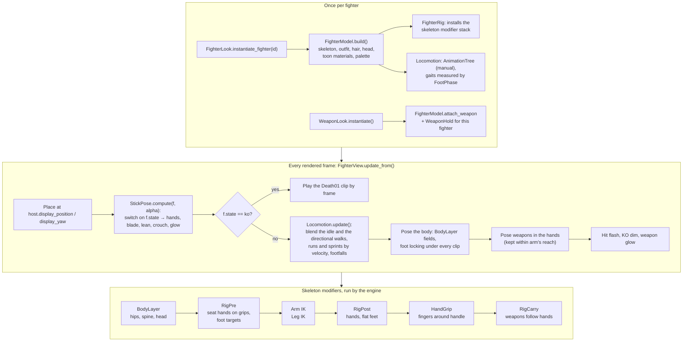

| File | Class | Role |
| --- | --- | --- |
| `fighter_view.gd` | `FighterView` | One side's fighter; runs the per-frame pipeline above. |
| `fighter_rig.gd` | `FighterRig` | Builds the modifier stack; seats hands on weapons. |
| `body_layer.gd` | `BodyLayer` | Procedural pelvis, spine and head over the clip. |
| `locomotion.gd` | `Locomotion` | The packs' directional walk, run and sprint clips blended by the rules' velocity on one shared step phase stepped per rules frame; tap steps, a backwards sprint turned away, the turn on the spot, footfalls at the clips' foot contacts (authored-animation task 29). |
| `foot_phase.gd` | `FootPhase` | Measures each locomotion clip's way, stride, mid-stances and foot contacts once. |
| `pose_check.gd` | `PoseCheck` | Pose quality checks for tools and tests (wrist bend, knee over toes, blade clearance). |
| `rig_callback.gd` | `RigCallback` | Lets the rig insert a function into the modifier stack. |

## 10. Fighters, weapons and arenas (content)

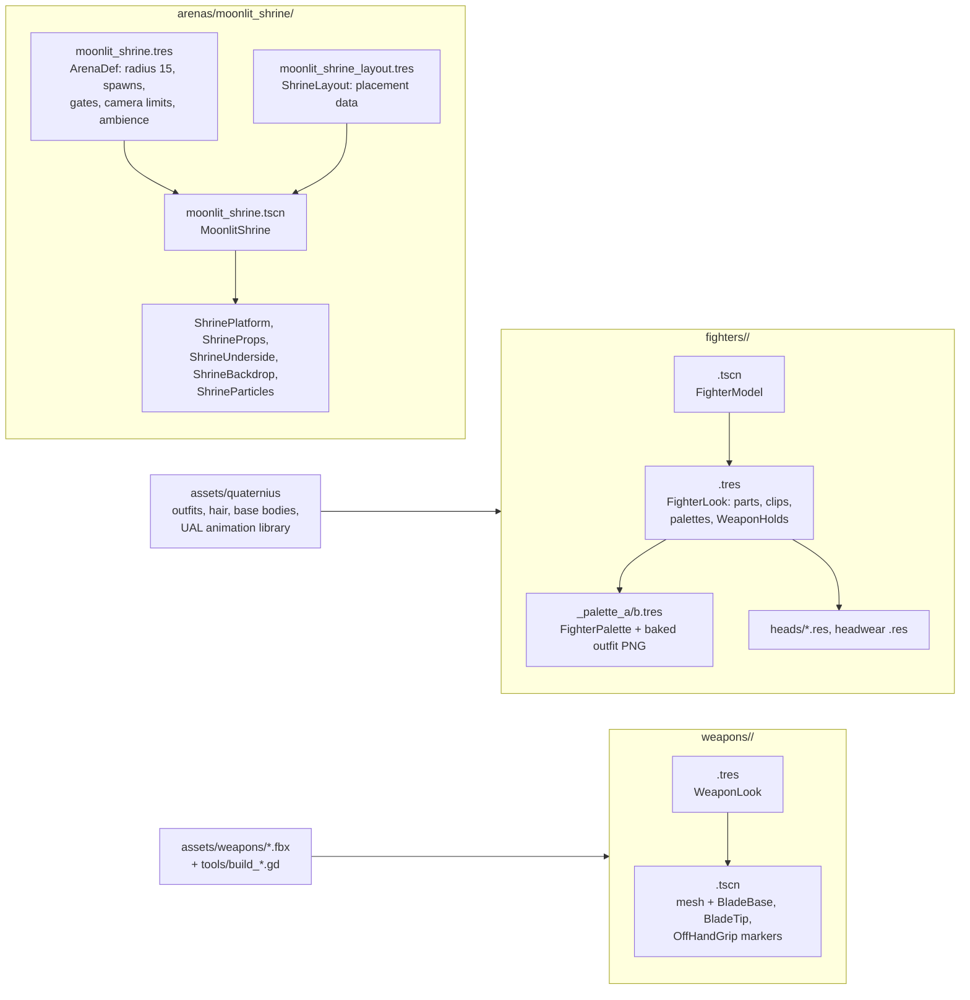

- A **fighter** (Rogue, Hunter) is a `FighterModel` scene plus a `FighterLook` resource. The look says which weapon each fighter holds how (`WeaponHold`: reverse grip, guard stance, wrist tweaks).
- A **weapon's look** (`WeaponLook`) is separate from its rules (`WeaponDef` in `sim/moves`). They share the id (`katana`, `greatsword`, `daggers`) by convention.
- An **arena** is an `ArenaDef` resource plus a scene that builds itself in code. Every arena must provide a `def` property, `Spawn0/1` and `Gate0/1` markers, its own environment, lights and `InkWashPass`, and apply the graphics preset to itself. Its `walkable_radius` must equal `SimConst.ARENA_RADIUS`, or `ArenaScenes` falls back to the stand-in.
  > **Superseded by [ADR 0001](adr/0001-animation-leads-realistic-look.md) (Oct 4, 2026):** This is the code today. ADR 0001 retires the ink-wash pass, so an arena will no longer need an `InkWashPass` once the slice lands.
- `fighters/preview/` is a dev stage for looking at fighters and weapons; it isn't part of the game or the export.

## 11. The look: shaders and graphics presets

> **Superseded by [ADR 0001](adr/0001-animation-leads-realistic-look.md) (Oct 4, 2026):** This section describes the code today. As the slice lands, a realistic look (physically based materials, dark lighting and volumetric fog under a painterly colour grade) replaces the toon materials, outlines and ink-wash pass. Four presets replace these three: Ultra is the reference preset at 4K and 60 fps on the RTX 3090, High and Medium scale down, and Low must hold 60 fps at 1080p, upscaled, on the Ryzen 7 4700U laptop.

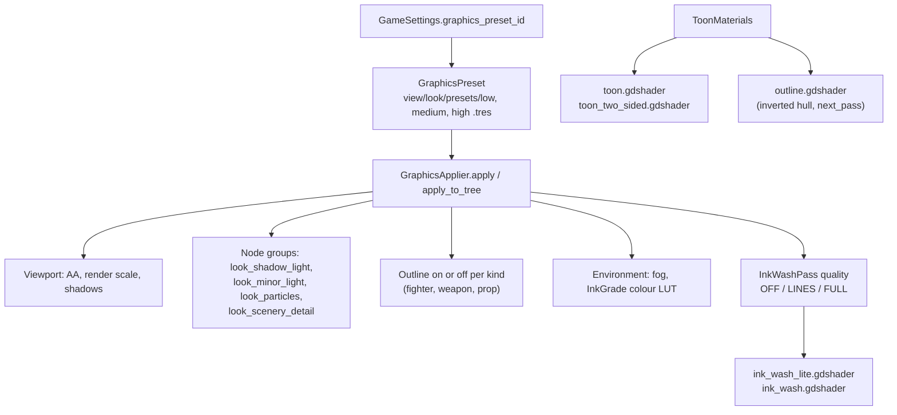

| Shader | Used by |
| --- | --- |
| `toon`, `toon_two_sided` (+ `toon_light`, `toon_surface` includes) | Fighters, weapons and props, through `ToonMaterials`. **Superseded by ADR 0001 (Oct 4):** Retires with the toon look; physically based materials replace it as the slice lands. |
| `outline` | Inverted-hull outline on fighters, weapons and (on High) props. **Superseded by ADR 0001 (Oct 4):** Retires; the realistic look has no outlines, and dyed palettes with key and rim lights on the fighters tell the sides apart. |
| `ink_wash_lite`, `ink_wash` (+ include) | The full-screen `InkWashPass` in each arena. **Superseded by ADR 0001 (Oct 4):** Retires; there is no ink-wash screen effect during play, and ink survives only as calligraphy in the UI. |
| `sky_moonlit`, `stone_floor`, `rock`, `cloud_sea`, `mountain_layer`, `lake_water`, `waterfall`, `mist_puff`, `lantern_glow`, `particle_glow`, `particle_flake` | The Moonlit Shrine |
| `weapons/katana/katana_blade`, `katana_wrap` | The Katana's blade and grip |
| `look_noise.gdshaderinc` | Shared noise texture (`LookNoise`) |

> **Superseded by [ADR 0001](adr/0001-animation-leads-realistic-look.md) (Oct 4, 2026):** Outlines and ink-wash quality leave the presets with the toon look. High, Medium and Low scale the realistic look down from Ultra.

Presets differ in shadow quality, prop outlines, ink-wash quality, height fog, particle count, minor lights and scenery detail. Fighter and weapon outlines are always on. Anything a preset should be able to turn off joins one of the `look_*` node groups.

## 12. Sound and music (`game/audio`)

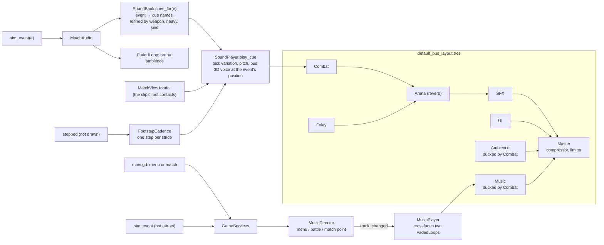

- Sounds are keyed by **cue name** in `SoundBank.CUES`: each cue lists its WAV variations under `assets/audio/sfx/`, volume, pitch range, bus and whether it is 3D. `SoundBank.EVENTS` maps each event type to cues; an empty list means the event is deliberately silent.
- `SoundPlayer` keeps fixed voice pools and steals the oldest voice when full. Some cues are delayed (the KO gong, the body fall).
- The attract duel is silent. Music changes only from the played match and the menus.
- `tools/sound_check.tscn` is a scene for listening to every cue.
- The WAVs are produced by `scripts/audio` (section 16).

## 13. Screens and the HUD (`game/ui`, `game/scenes`)

The menus are the playable skeleton's; plan task 22 replaces them with the full set (character select, Training, Versus, Settings, Controls).

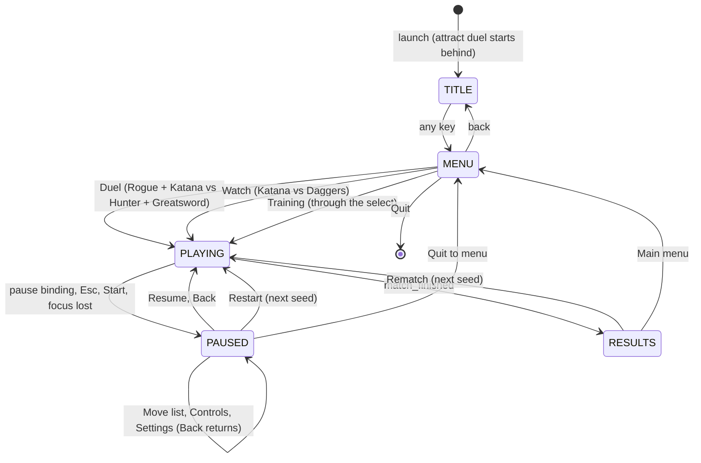

| File | Class | Role |
| --- | --- | --- |
| `scenes/main.gd` | | The screen switcher above; seeds matches; forwards events to the music. |
| `scenes/smoke_run.gd` | `SmokeRun` | `--smoke`: plays Watch to the results, exits 0 or 1. |
| `ui/menus/menu_screen.gd` | `MenuScreen` | A generic menu panel with keyboard, mouse and controller navigation. |
| `ui/menus/title_screen.gd` | `TitleScreen` | "Press any key". |
| `ui/menus/pause_screen.gd` | `PauseScreen` | 休止 Paused: Resume, Move list, Controls, Settings, Restart, Quit to menu; in Training, Dummy and Refill health rows above them. |
| `ui/menus/results_screen.gd` | `ResultsScreen` | Winner, rounds, seven stats, Rematch and Main menu. |
| `ui/hud/match_hud.gd/.tscn` | `MatchHud` | HP and posture bars, round pips, ultimate badge, announcements and toasts timed on rules steps, button hints, and in Training the `TrainingPanel`. Hidden in the attract duel. |
| `ui/hud/hud_toasts.gd` | `HudToasts` | The toasts under the centre: `for_event()` says what a rules event toasts from the player's side or Watch's (no nodes); up to three on screen, 69 rules steps each, held by a pause. |
| `ui/hud/training_panel.gd` | `TrainingPanel` | Training's panel at the bottom left: "Dummy · <weapon>", the nine behaviour chips (keys 1–9) and refill (key 0), clicks too; a digit bound in the player's profile is left to its action. Follows `MatchHost.training_changed` and `loadout_changed`; hidden while paused. |
| `ui/hud/hud_bar.gd` | `HudBar` | A meter with a lagging band. |

## 14. The web demo (`src/`)

The web demo has the same shape as the Godot game, because the Godot game was ported from it.

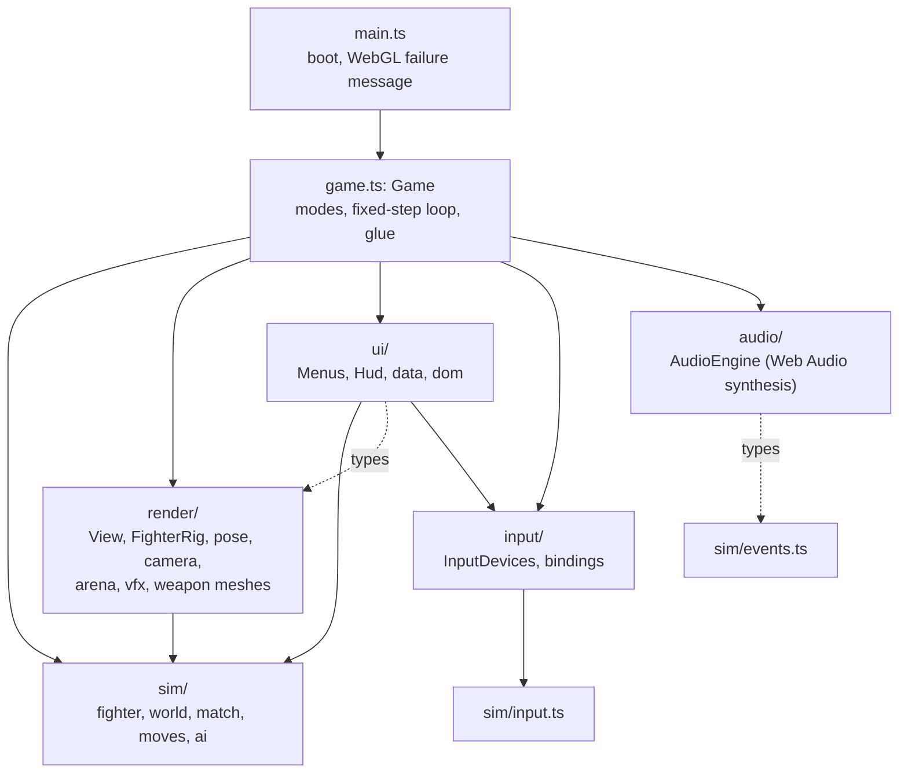

- **Loop.** `Game.loop()` runs on `requestAnimationFrame`: poll devices, handle menu navigation, then the same accumulator as `MatchHost` (at most 6 steps, slow motion scales it). `Game.step()` samples input or asks the brain, calls `match.step()`, drains events and hands them to audio, HUD and view. Unlike Godot, the web demo doesn't interpolate positions; `alpha` only smooths attack poses.
- **Rendering.** `FighterRig` builds a block puppet from primitives with two-bone IK; `computePose()` in `pose.ts` picks a pose from the fighter's state and three keyframes per attack archetype. Versus draws the scene twice into a split screen. If shaders fail, `View` falls back to safer materials in two levels.
- **Sound.** Everything is synthesised with Web Audio at runtime; there are no audio files in the web build.
- **Build.** `npm run build` type-checks, builds with `vite-plugin-singlefile` (everything inlined into `dist/index.html`) and runs `scripts/make-artifact.mjs` (adds the three.js licence, writes a page-content variant). The committed `Monomachia.html` is a copy of that build.
- **Saved data** lives in `localStorage`: `monomachia.settings`, `monomachia.profiles.v1`, `monomachia.audio`, `monomachia.lastSelect`.

| Web file | Godot counterpart |
| --- | --- |
| `src/sim/fighter.ts`, `world.ts`, `match.ts`, `input.ts`, `events.ts`, `rng.ts`, `math.ts`, `constants.ts` | `game/sim/fighter.gd`, `world.gd`, `match.gd`, `input_tracker.gd` + `raw_input.gd` + `btn.gd`, `events.gd`, `rng.gd`, `sim_math.gd` + `js_math.gd` + `v2/v3.gd`, `constants.gd` |
| `src/sim/moves/*.ts` | `game/sim/moves/*.gd` |
| `src/sim/ai/brain.ts`, `training.ts` | `game/sim/ai/ai_brain.gd`, `training_brain.gd` |
| `src/game.ts` (loop) | `game/view/match/match_host.gd` |
| `src/game.ts` (modes, menus glue) | `game/scenes/main.gd` |
| `src/render/*` | `game/view/*`, `game/arenas`, `game/fighters`, `game/weapons` |
| `src/input/*` | `game/input/*` |
| `src/ui/hud.ts`, `menus.ts` | `game/ui/hud`, `game/ui/menus` |
| `src/audio/audio.ts` | `game/audio/*` + `scripts/audio/synth.mjs` (its sounds, rendered to WAV) |

## 15. Tests

`npm test` runs both suites: Vitest for the web side, then GUT in headless Godot.

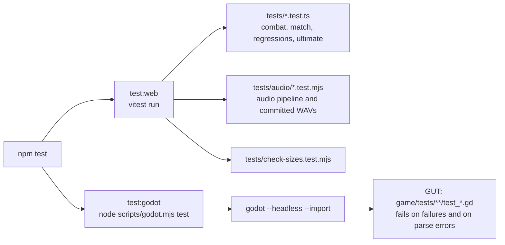

| Folder | Files | What it covers |
| --- | --- | --- |
| `game/tests/` (root) | 2 | Godot version; every scene loads |
| `game/tests/sim` | 16 | Ports of the web rule tests, fixture parity (`rng`, `moves`, `math`, port regressions), fluid combat, each weapon's strings, string continuity, training brain, soak. **Superseded by ADR 0001 (Oct 4):** Tests that pin frame data to the web demo, such as the `moves` fixture parity, will be replaced as the slice lands, and a test will keep every attack inside its timing band. |
| `game/tests/view` | 24 | Arenas, camera, fighter rig and view, stick pose, locomotion, toon and ink look, presets, MatchHost, main flow, the `--smoke` run, tool scenes. **Superseded by ADR 0001 (Oct 4):** The toon and ink look tests will be replaced as the slice lands. |
| `game/tests/audio` | 10 | Bus layout and ducking, FadedLoop, footsteps, music director and player, sound bank, sound player, headless playback of a match |
| `game/tests/input` | 7 | Device state, InputFeed, labels, profiles, rebinding, sampling, seats and pause |
| `game/tests/content` | 5 | Animation library, asset size budgets, fighter scenes, palettes, weapon models. **Superseded by ADR 0001 (Oct 4):** Size budgets per place (public repository, asset repository, shipped game) replace the asset budget test's 110 MB art cap, and the test will be replaced as the slice lands. |
| `game/tests/core` | 3 | GameServices, GameSettings, MatchConfig and MatchSide |
| `game/tests/fixtures` | data | JSON from the TypeScript (`rng`, `moves`, `math`, `port`) and a hand-made arena scene |

> **Superseded by [ADR 0001](adr/0001-animation-leads-realistic-look.md) (Oct 4, 2026):** The ink-line and outline-width render checks below belong to the toon look, which ADR 0001 retires. They will be replaced as the slice lands.

Rule tests build a `World` directly, feed it scripted `RawInput`s and assert on events and state; `sim_helpers.gd` holds the shared helpers. Nothing graphical is needed. Render checks that need a real window (shaders compile, ink lines, outline width) are screenshot scenes in `game/tools/shot_scenes` run by `npm run shots`.

## 16. Tools, scripts and pipelines

### 16.1 npm commands

| Command | What it runs |
| --- | --- |
| `npm run dev` | Web demo dev server on port 5173 |
| `npm test`, `npm run typecheck` | Both suites; both type checks (`tsc` and `tools/typecheck.gd`) |
| `npm run build` | The web demo's single HTML file |
| `npm run soak -- 40` | 40 computer matches in the TypeScript rules |
| `npm run soak:godot -- 40`, `npm run soak:tune` | The same in the Godot rules, with the balance report (`soak:tune` runs 300) |
| `npm run godot:dev`, `npm run godot:run` | Open the Godot editor; run the game |
| `npm run shots -- <scene> <out.png> [frames]` | Render a screenshot in an off-screen window |
| `npm run godot -- build` | Export the Windows build to `build/windows/Monomachia.exe` |
| `npm run godot -- script res://tools/x.gd` | Run any headless tool script |
| `npm run godot:fixtures` | Regenerate the TypeScript parity fixtures |
| `npm run audio:sonniss`, `audio:synth`, `audio:music` | Regenerate sound effects and music |
| `npm run check:sizes` | Fail on any tracked file over 10 MB |

### 16.2 The Godot runner (`scripts/godot.mjs`)

Every Godot command goes through this script. It finds Godot from the `GODOT` environment variable, then `godot` or `godot4` on the PATH, then a one-line `.godot-path` file at the repo root (gitignored; a worktree also looks in the main checkout). On Windows point it at the `*_console.exe`. It runs Godot with a watchdog timeout, because a script error in a `--script` run hangs Godot instead of exiting, and it scans the output for `SCRIPT ERROR`, `Parse Error` and `SHADER ERROR`.

### 16.3 Pipelines

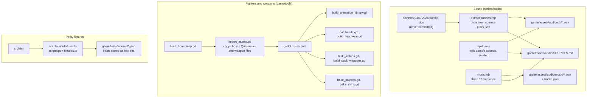

Other tools in `game/tools`: `soak.gd` and `counterlab.gd` (ports of the TypeScript scripts), `typecheck.gd`, `shot.gd` (behind `npm run shots`), `inspect_scene.gd` (print a model's nodes, bones and clips), `foot_phase.gd` (gait numbers), `move_bench.gd` (play a move frame by frame for tests and contact sheets), `texel_map.gd` and `js_format.gd` (helpers). `game/tools/shot_scenes/` holds the screenshot scenes: arena views, gameplay moments, the look bench, animation contact sheets (`move_sheet`) and the pass/fail render checks. The export excludes `tests/`, `tools/`, `addons/gut/` and `fighters/preview/`.

On the web side, `scripts/browser.mjs` plays the built demo in a headless browser (needs Playwright, which isn't a dependency) and `scripts/counterlab.ts` measures how often the computer lands each counter.

## 17. CI and releases

```mermaid
flowchart LR
    PUSH["push or pull request"] --> CI1["ci.yml: test-and-build<br/>setup Godot 4.7.2, npm ci,<br/>check:sizes, npm test, typecheck,<br/>4-match Godot soak, web build"]
    CI1 --> ART1["artifact: Monomachia (web HTML)"]
    CI1 --> CI2["ci.yml: export-windows<br/>Godot with export templates,<br/>npm run godot -- build"]
    CI2 --> ART2["artifact: Monomachia-windows"]
    REL["release published"] --> R1["release.yml<br/>test, build, attach Monomachia.html"]
    MAN["manual run"] --> P1["pages.yml<br/>test, build, deploy to GitHub Pages"]
```

`pages.yml` runs `npm test` without installing Godot, so it fails as it stands; plan task 25 retires it along with the web version. The release workflow still attaches only the web HTML; attaching the Windows build is planned (task 25).

## 18. Docs and where work is tracked

```mermaid
flowchart TD
    DESIGN["docs/design.md<br/>the full game: what to build"] --> SPEC["docs/specs/godot-rebuild.md<br/>user stories, decisions, testing"]
    MVP["docs/mvp-spec.md<br/>how the web demo works"] --> SPEC
    SPEC --> PLAN["docs/plans/godot-rebuild.md<br/>phases A-H, tasks, build order, progress"]
    PLAN --> NOTES["docs/plans/godot-rebuild-notes/*<br/>research per area (the plan wins)"]
    PLAN --> CODE["game/"]
    SPIKE["docs/research/animation-spike<br/>can weapon paths animate the fighters?"] --> PLAN
    GLOSS["GLOSSARY.md<br/>the vocabulary"] -.-> DESIGN & SPEC & CODE
    CLAUDE["CLAUDE.md<br/>workflow: spec, plan, implement;<br/>branch and PR per change"] -.-> PLAN
```

> **Superseded by [ADR 0001](adr/0001-animation-leads-realistic-look.md) (Oct 4, 2026):** The rebuild plan's open tasks are triaged against ADR 0001 (look-independent ones finished, tuning and effects moved into the slice plan, toon-only ones retired), and the authored-animation spec closes after its task 30b. The rebuild merges into `master` first, so new work branches from `master` again.

The plan's **build order** runs in 14 stages, one task at a time. Stages 1 to 6 are done (safety nets, the look and real fighters, the shrine, fluid rules, sound and music, the new strings). Stage 7 (swing foundations, where weapon paths drive both the animation and the hit detection) is in progress on its own branch, and stage 8 (the fighter animation core) is partly done. Check the plan's Progress section for the current state rather than this page.

Major features follow `CLAUDE.md`: a spec in `docs/specs/`, a plan in `docs/plans/`, then implementation task by task, each on a branch with a pull request.

## 19. Recipes: where to make common changes

| I want to... | Start here |
| --- | --- |
| Change a move's timing or damage | `game/sim/moves/<weapon>.gd`, then a test in `game/tests/sim`. **Superseded by ADR 0001 (Oct 4):** As the slice lands, an attack's startup, active and recovery come from its clip with no hand overrides, so its timing changes by editing the clip until it lands inside its timing band. |
| Change global tuning (parry, posture, movement) | `game/sim/constants.gd`, then a test, then the docs that record the number |
| Add a rules event | Emit it in `world.gd` or `fighter.gd`, add it to `SimEvents.TYPES` and the header in `events.gd`, then decide its sound (`SoundBank.EVENTS`), HUD text (`match_hud.gd`) and view reaction (`match_view.gd`) |
| Give an event a new sound | A cue in `SoundBank.CUES`, its WAVs from `scripts/audio`, and the mapping in `SoundBank.EVENTS` or `cues_for()` |
| Change how a state looks | `stick_pose.gd` today; the swing and animation tasks (7, 14, 15) replace it |
| Add a fighter | `fighters/<id>/` (scene, `FighterLook`, palettes), `FighterLook.IDS`, and the asset tools |
| Add a weapon's look | `weapons/<id>/` (`WeaponLook`, scene with markers), `WeaponLook.IDS`, holds in each `FighterLook` |
| Add an arena | An `ArenaDef` resource and scene in `arenas/<id>/`, registered in `ArenaScenes.DEFS`; radius must match the rules |
| Add a graphics option | A field on `GraphicsPreset`, the three preset files, and `GraphicsApplier`. **Superseded by ADR 0001 (Oct 4):** Four presets (Ultra, High, Medium, Low) replace the three as the slice lands, with Ultra the reference preset. |
| Add a binding or action | `Bindings.ACTIONS`, `ACTION_BUTTON`, the default sets, `Btn` if it is a new rules button |
| Add a screen | Build it in `ui/menus`, switch to it from `scenes/main.gd` (task 22 reworks this) |
| Check the balance after a change | `npm run soak:godot -- 40` |
| See a change | `npm run godot:run`, or a screenshot with `npm run shots` |

## 20. Traps

- **Keep the rules headless.** No `Node`, scene, rendering, audio or `Input` in `game/sim`. Tests and the soak depend on it.
- **Determinism.** Don't use Godot's `randf()`, `Vector3`, `sin` or `round` in the rules. Use `Rng`, `V3`, `JsMath` and `SimMath.js_round`. They exist because Godot's float32 vectors and C-runtime maths differ in the last bit from V8, which made the port drift. Keep random draws in a fixed order (a short-circuited condition that skips a draw changes every later one).
- **Update order matters.** Fighter 0 updates before fighter 1; ultimate hits are queued until both have updated; combat outcomes are all decided before any is applied. Changing any of these changes results.
- **Frames, not seconds.** Every rules duration is in 60 Hz frames. `SimConst.FPS` and `DT` are the only clock.
- **The view must not write to the rules.** Read `host.fighter(i)` and react to `sim_event`; never set a fighter's fields from the view, HUD or audio.
- **Reference cycles.** `World` and the brains have `dispose()` to break `RefCounted` cycles (fighter ↔ opponent ↔ world). Call it when throwing a match away; `MatchHost.stop()` does.
- **Godot's JSON and float literals round differently from V8**, which is why the parity fixtures store floats as hex bit patterns and `JsMath` builds its constants from bits.
- **GUT skips a test file that doesn't parse**, silently. `godot.mjs test` fails on parse errors for that reason; keep it that way.
- **Saved settings leak into tests.** Tests and screenshots set `MONOMACHIA_DEFAULT_SETTINGS=1`, so they start from the default settings and one fresh controls profile, and never write the player's files. Do the same in any new runner.
- **Big files.** `check:sizes` fails CI on any tracked file over 10 MB. Never commit the raw Sonniss recordings.
- **`docs/adr/` doesn't exist yet**, although `docs/agents/domain.md` mentions it. Create it with the first ADR.
  > **Superseded by [ADR 0001](adr/0001-animation-leads-realistic-look.md) (Oct 4, 2026):** `docs/adr/` now exists, and ADR 0001 is its first record.
